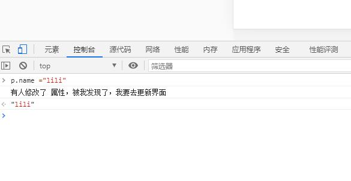
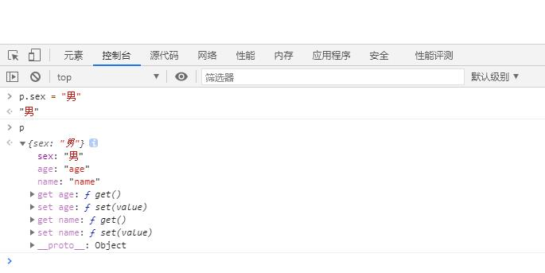
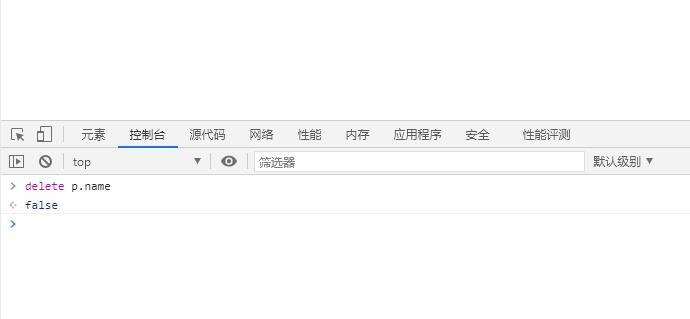
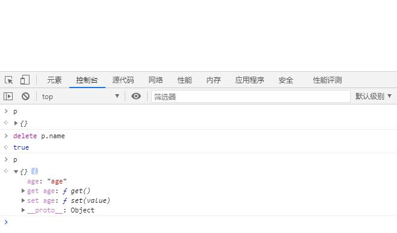
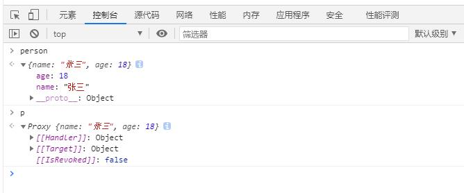
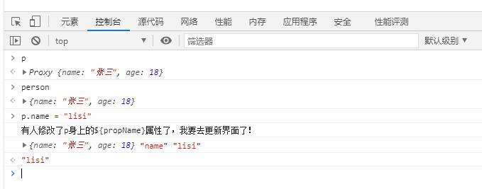

136 尚硅谷
[toc]
## 136 Vue3 带来了什么？
    （2600+次提交，30+RFC（请求意见稿），600+次PR）
    **Vue3github**:https://github.com/vuejs/vue-next/releases/tag/v3.0.0

- 性能提升
- 源码的升级:
    使用Proxy代替defineProperty实现响应式
    重写虚拟Dom和使用`Tree-shaking`去除没有使用的代码
- 拥抱TypeScript
- 新的特性：
    组合式API
    - setup配置
    - ref和reactive
    - watchhe与watchEffect

    新的内置组件：
    - 
    其他的改变：

## 创建一个`vue3`的项目工程
### 137、使用  `vue/cli`  创建

官网：

可配置淘宝镜像或者采用科学上网工具来提升速度

```shell
## 查看@vue/cli 版本，确保在4.5.0以上
vue --version
## 安装或者升级你的vue/cli
npm install -g @vue/cli
## 创建
vue create vue_test
## 启动
cd vue_test
npm run serve

```
### 138、使用 `vite` 创建

vite官网：https://vitejs.cn
- 什么事vite?  新一代前段构建工具
- 优势如下：
    - 开发环境中，无需打包操作，可快速地冷启动
    - 轻量快速地热重载（HMR）
    - 真正的按需编译，不用在等待整个应用编译完成。
    - 丰富的功能
    - 优化的构建

- 传统构建webpack 和 vite 的构建对比图
    - wepack：是一个入口，根据路由，分析，都准备好。
    - Vite：是根据你进来的网页 查看入口，再准备好了。

```shell
## 创建工程
npm init vite-app <project-name>
## 进入工程目录
cd <project-name>
## 安装依赖
npm i
## 运行
npm run dev

```
关闭语法检查：配置`vue.config.js`,配置 `lintOnSave:false` 即可

## 139 看看`vue3`的项目目录

先看一下`src`下`main.js`文件

```js
// 引入的不是 Vue 构造函数了，是一个名为createApp 工厂函数
// 这里不支持vue2的写法
import { createApp, VueElement } from 'vue'
import App from './App.vue'
import './index.css'

createApp(App).mount('#app')
// 上面可以写成：
// 实际是创建一个实力对象--app （类似于之前的vue2 中的vm，但是app比VM更轻）
// const app = createApp(App)
// console.log("app",app);
//挂载
// app.mount("#app")

// 去除挂载
// setTimeout( ()=>{
//     app.unmount("#app")
// },2000)


// vue2 原来是这么写的
// const vm = new Vue({
//     render:h => h(App)
// })
// vm.$mount('#app')

```
再看看`App.vue`文件
```vue
<template>
    <!-- vue 3 可以没有根标签结构 -->
  
  <HelloWorld msg="Hello Vue 3.0 + Vite" />
</template>
```
## 140 安装`vue3 devtools`
 在 `chrome` 浏览器应用商店搜索进行安装
 或者在 `github` 上下载进行安装

## 141 常用的`Composition API`
拉开序幕的`setup`

- 1 理解：`Vue3.0` 重点额一个新的配置项，值是一个**函数**。

- 2 `setup`是所有的`Composition API` “**表演的舞台**”

- 3 组件中用到的：数据、方法等等 均要配置在`setup`中

- 4 `setup` 函数的两种返回值：

    - 若返回一个对象，则对象中的属性、方法，在模板中均可以直接使用！（重点关注）
    - 若返回一个渲染函数，则可以自定义渲染内容。

- 5 注意点：

    - 尽量不要于`vue2` 配置混用

    > `vue2.x` 配置（data,methods,computed...）中，均<font color="red">可以访问</font>到`setup`中的属性 方法

    > 但在`setup`中<font color="red">不能访问</font>`vue2.x` 配置（data,methods,...）
    
    > 如果有重名，`setup`优先
    
    - `setup`不能是一个`async` 函数， 因为返回值不再是`return` 的对象，而是`promise` ，模板看不到 `return` 对象的属性

```vue
<!-- App.vue -->
<template>
  
  <HelloWorld msg="Hello Vue 3.0 + Vite" />
  <div> 姓名：{{name}}</div>
  <div> 年龄：{{age}}</div>
  <div> a：{{a}}</div>
  <button @click="sayHello"> vue3 说话</button>
  <br/>
  <br/>
  <button @click="sayWelcome"> vue2 说话</button>
  <br/>
  <br/>
  <button @click="test1"> vue2 读取 vue 3 的 数据</button>
  <br/>
  <br/>
  <button @click="test2"> vue3 读取 vue 2 的 数据</button>
</template>

<script>
import HelloWorld from './components/HelloWorld.vue'
import { h }  from 'vue'
export default {
  name: 'App',
  //vue 2 的写法-------
  data(){
    return {
      sex:"男",
      a:"100",
    }

  },
  methods:{
    sayWelcome() {
      alert(`我是${ this.sex }`)
    },
    test1() {
      alert(`我是${ this.name }`)
    },
  },

  // ----------------------------

  //此处只是测试一下setuP，不考虑响应式
  setup(){
    //数据
    let name = "张三";
    let age = "18";
    let a = "18";

    //方法
    function sayHello(){
      alert(`我叫${ name }，今年${ age }岁了`)
    }

    //方法
    function test2(){
      alert(`我vue3 叫${ this.sex }`)
    }

    // 返回一个对象，则对象中的属性、方法，在模板中均可以直接使用！
    return {
      name,
      age,
      sayHello,
      test2,
      a
    }

    // 还可以返回一个函数，渲染函数，则可以自定义渲染内容。
    // return ()=>h('h1','哈哈')


  },
  components: {
    HelloWorld
  }
}
</script>

```

## 142 `ref`数据响应式

- 定义：ref是一个函数：

- 作用：定义一个响应式数据

- 语法：`const xx = ref(initValue)`
    - 创建一个包含响应式数据的<font color="red">引用对象（reference对象，简称ref对象）</font>
    - JS 中操作数据： `xxx.value = newValue`
    - 模板中读取数据：不需要`.value` 直接`<div>{{ xxx}}</div>`
    `reference`  引用
    `implement`  实现

- 备注：
    - 接收的数据可以是：基本数据类型，也可以是对象类型
    - 基本类型的数据：响应式依然是依靠 `Object.defineProperty()` 的 `get`  和 `set` 完成的
    - 对象类型的数据： 内部“求助”了`vue3.0` 中的一个新函数--`reactive` 函数（`reactive` 函数还是使用`Object.Proxy()`实现的）
```js
/* APP.vue */

<template>
  <div> 姓名：{{name}}</div>
  <div> 年龄：{{age}}</div>
  <button @click="changeInfo">修改</button>
</template>

<script>
import {ref} from  "vue"
export default {
  name: 'App',
  
  //此处只是测试一下setuP，不考虑响应式
  setup(){

    //数据  这种数据没有响应式
    // let name = "张三";
    // let age = "18";

    // 使用ref函数实现数据响应式
    let name = ref("张三");
    let age = ref(18);


    function changeInfo(){
      // name = "李四";
      // age = "11";
 
      name.value = "李四";
      age.value = "11";

      //模板里不用.value,检查出了是ref对象，解析出来

      //修改了数据，但是没有数据相应
      console.log("name","age",name,age,job);

    }

    // 返回一个对象，则对象中的属性、方法，在模板中均可以直接使用！
    return {
      name,
      age,
      changeInfo

    }

  },
}
</script>

```
## 143 通过ref函数  处理对象类型

基本数据类型 使用的是`Object.defineProperty()`实现数据相应，
对象数据类型 使用的是`Object.Proxy()`代理对象，实现数据相应，

```vue
<template>
  <div> 姓名：{{name}}</div>
  <div> 年龄：{{age}}</div>
  <div> job：{{job.type}}</div>
  <button @click="changeInfo">修改</button>
</template>

<script>
import {ref} from  "vue"
export default {
  name: 'App',
  
  //此处只是测试一下setuP，不考虑响应式
  setup(){

    //数据  这种数据没有响应式
    // let name = "张三";
    // let age = "18";

    // 使用ref函数实现数据响应式
    let name = ref("张三");
    let age = ref(18);
    let job = ref({
      type:"11",
      salary:"30k",
    });


    function changeInfo(){ 
      name.value = "李四";
      age.value = "11";
      console.log("job.value",job.value);

      job.value.type = "22";


      //模板里不用.value,检查出了是ref对象，解析出来

      //修改了数据，但是没有数据相应
      console.log("name","age",name,age,job);

    }

    // 返回一个对象，则对象中的属性、方法，在模板中均可以直接使用！
    return {
      name,
      age,
      job,
      changeInfo

    }

  },
}
</script>

```
## 144 `reactive` 函数 
- **作用**：定义一个<font color="red">对象类型</font>的响应式数据，（基本类型不要用它，要用 `ref` 函数）
- **语法**：`const obj2代理对象 = reactive(obj1源对象)` 接收一个对象（或数组），返回一个<font color="red">代理对象（ `proxy` 对象）</font>
- `reactive` 定义的响应式数据是"深层次的"
- 内部基于 `ES6` 的 `Proxy` 实现的，通过代理对象操作源对象内部数据进行操作

```vue
<template>
  <div> 姓名：{{name}}</div>
  <div> 年龄：{{age}}</div>
  <div> job:{{job.type}}</div>
  <div> 爱好 :
  <ul>
    <li v-for="item in hobby" key="item">{{item}}</li>
  </ul> </div>
  <button @click="changeInfo">修改</button>
</template>

<script>
import {ref ,reactive} from  "vue"
export default {
  name: 'App',
  
  //此处只是测试一下setuP，不考虑响应式
  setup(){

    //数据  这种数据没有响应式
    // let name = "张三";
    // let age = "18";

    // 使用ref函数实现数据响应式
    let name = ref("张三");
    let age = ref(18);

    //使用reactive实现对象数据类型
    let job = reactive({
      type:"11",
      salary:"30k",
    });

    let hobby = reactive(["11",2,3,4]);


    function changeInfo(){ 
      console.log("job",job);

      job.type = "22";
      hobby[0] = "9999";
    }

    // 返回一个对象，则对象中的属性、方法，在模板中均可以直接使用！
    return {
      name,
      age,
      job,
      hobby,
      changeInfo

    }

  },
}
</script>


```

## 145 `Vue 3.0` 中的响应式原理

**`vue 2.0` 中的响应式原理**

- 实现原理：
  - 对象类型：通过 `Object.defineProperty()` 对属性的读取，修改，进行拦截（数据劫持）
  - 数组类型：通过 重写更新数组的一系列方法累实现拦截。  （对数组的变更方法进行了包裹）

  ```js

  // 原数据
  let person = {
      name:"张三",
      age:18
  }

  // 模拟vue2中实现数据响应式
  // 通过Object.keys()拿到person的每一个属性去循环一下，去监听数据的读取及修改
  let p = {}  ;

  let personkeys = Object.keys(person);

  // console.log(personkeys);

  personkeys.forEach( item =>{
      // console.log(item);

      Object.defineProperty(p,item,{
        configurable:true,

      get(){
          // 有人读取 item 时，调用
          return item
      },
      set(value){
          console.log("有人修改了 属性，被我发现了，我要去更新界面")
          //有人修改  item 时 调用
          item = value
      },
  })
  })
  ```
看看修改一个数据能否数据相应：
在浏览器中运行`p.name = "lisi"`,进行修改数据，即弹出日志

 
我们发现修改一个数据属性，是响应式的。

看看添加一个数据能否数据相应：
在浏览器中运行`p.sex = "男"`,进行修改数据，即弹出日志

 

有`get` `set` 的才是响应式，我们现在的`sex`只是死数据

看看删除一个存在的数据能否数据相应：
在浏览器中运行`delete p.sex`,进行修改数据，即弹出日志


配置一下`configurable:true,`,然后就可以删除

在浏览器中运行`delete p.sex`,进行修改数据，即弹出日志




- <font color="red">存在问题</font>：
  - <font color="red">新增属性、删除属性、界面不会更新</font>。

      - `vue 2.0` 中的 新增及修改数据后不数据相应 解决办法1 ：`this.$set(this.persion,'name',"wang")`
      - `vue 2.0` 中的 新增及修改数据后不数据相应 解决办法2 ：先导入`vue` `import vue from 'vue'`,然后使用`vue.set`方法`vue.set(this.persion,'name',"wang")`

      - `vue 2.0` 中的 删除后数据相应 解决办法1 ：`this.$delete(this.persion,'name')`
      - `vue 2.0` 中的 删除后数据相应 解决办法2 ：先导入`vue` `import vue from 'vue'`,然后使用`vue.set`方法`vue.delete(this.persion,'name')`

  - <font color="red">直接通过下标修改数组，界面不会自动更新</font>
      - `vue 2.0` 中的 修改数组数据实时相应 解决办法1 ：`this.arr.splice(0,1,"新值")`

## 146 **vue 3.0 的响应式**
- 实现原理：
  - 通过 `Proxy` （代理） ：拦截对象中的任意属性的变化，包括：属性值得读写、属性的添加、属性的删除等
  - 通过 `Reflect` （反射）： 对源代理对象的属性进行操作。

`MDN` 文档中描述的 `Proxy` 和 `Reflect` 
    - `Proxy`： https://developer.mozilla.org/zh-CN/docs/Web/JavaScript/Reference/Global_Objects/Proxy
    - `Reflect` ： https://developer.mozilla.org/zh-CN/docs/Web/JavaScript/Reference/Global_Objects/Reflect

```js
const p = new Proxy(person, {
    // 读取的时候调用
    get(target, propName) {
        return Reflect.get(target,propName)
    },

    // 新增，修改的时候调用
    set(target, propName, value) {
        Reflect.set(target, propName, value)
    },

    //删除时候,调用
    deleteProperty(target, propName) {
        Reflect.deleteProperty(target, propName)
    }
})
```
```js

// 原数据
let person = {
    name:"张三",
    age:18
}
// 模拟vue3中实现数据响应式
const p = new Proxy(person,{})

```
在浏览器中，运行 `person` 和 `p` 看看


我们继续完善一下代码，然后再浏览器运行一下：

```js
// 原数据
let person = {
    name:"张三",
    age:18
}
// 模拟vue3中实现数据响应式
const p = new Proxy(person,{

  // 读取时获取到
    get(target,propName){
      console.log(`有人读取p身上的${propName}属性了`,target,propName);
      return target[propName]
    },

    // 修改时获取到  增加的时候
    set(target,propName,value){
      console.log("有人修改了p身上的${propName}属性了，我要去更新界面了！");
      console.log(target,propName,value);
      target[propName] = value
    }

    //删除时候呢？
    deleteProperty(target,propName){
       console.log("有人删除了p身上的${propName}属性了，我要去更新界面了！");
       return delete target[propName]
        
    }
})
```
结果如下：


实现删除呢？

代码如下：

```js
// 原数据
let person = {
    name: "张三",
    age: 18
}
// 模拟vue3中实现数据响应式
const p = new Proxy(person, {

    // 读取的时候调用
    get(target, propName) {
        console.log(`有人读取p身上的${propName}属性了`, target, propName);
        return target[propName]
    },

    // 新增，修改的时候调用
    set(target, propName, value) {
        console.log("有人修改了p身上的${propName}属性了，我要去更新界面了！");
        console.log(target, propName, value);
        target[propName] = value
    },

    //删除时候,调用
    deleteProperty(target, propName) {
        console.log("有人删除了p身上的${propName}属性了，我要去更新界面了！");
        return delete target[propName]
    }
})
```

## 147 `vue 3.0` 响应式原理`reflect` （反射对象）
上面是实现了数据的响应式，但是`vue 3.0` 不是这么实现的
```js
let obj = { a: 1, b: 2 };

// Object.defineProperty(obj,'c',{
//     get(){
//         return 3
//     }
// })
// Object.defineProperty(obj,'c',{
//     get(){
//         return 4
//     }
// })

const  x1 = Reflect.defineProperty(obj, 'c', {
    get() {
        return 3
    }
})
const  x2 = Reflect.defineProperty(obj, 'c', {
    get() {
        return 4
    }
})
console.log("111",x1,x2);
```
## 148  `reactive` 对比 `ref` 
**从定义数据角度对比**

  - `ref` 用来定义：<font color="red">基本数据类型</font>
  - `reactive` 用来定义：<font color="red">对象或数组 数据类型</font>
  - 备注：ref也可以用来定义<font color="red">对象或数组 类型数据</font>，它内部会通过`reactive`转为<font color="red">代理对象。</font>

**从原理角度对比**：

  - `ref` 通过`Object.defineProperty()` 的 `get` 和 `set` 来实现响应式（数据劫持）。
  - `reactive` 通过 `Proxy` 来实现响应式（数据劫持） ，并通过<font color="red">`Reflect`</font> 操作<font color="red">源对象</font> 内部的数据

**从使用角度对比**：
  - `ref` 定义的数据： 操作数据 `Reflect`<font color="red">需要</font> `.value` 读取数据是模板直接读取`Reflect`<font color="red">不需要</font>`.value`
  - `reactive` 定义的数据： 操作数据于读取数据：<font color="red">均不需要</font>`.value`

## 149 `setup` 的两个注意点：

`setup` 执行的时机
  - 在 `beforeCreate` 之前执行一次， `this` 是 `undefined`

`setup` 的参数
  - `props` ：值为对象，包含：组件外部传递过来，且组件内部声明接收了的属性。
  - `context` : 上下文对象
    - `attrs` : 值为对象，包含：组件外部传递过来。但是没有在 `props` 配置中声明的属性，相当于 `this.$attrs`
    - `slots` : 收到的插槽内容，相当于 `this.$slots`
    - `emit` :  分发自定义事件的函数，相当于 `this.$emit`


