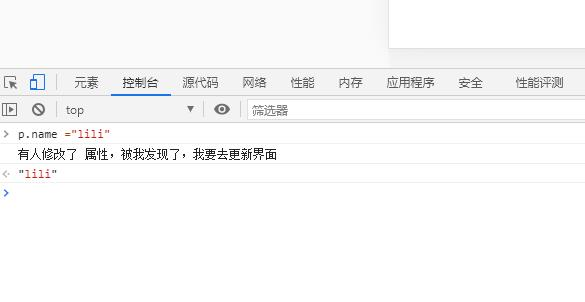
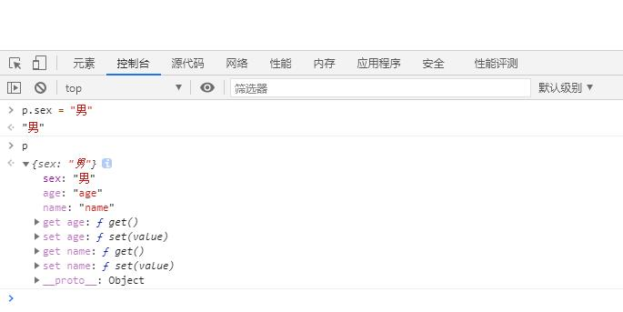
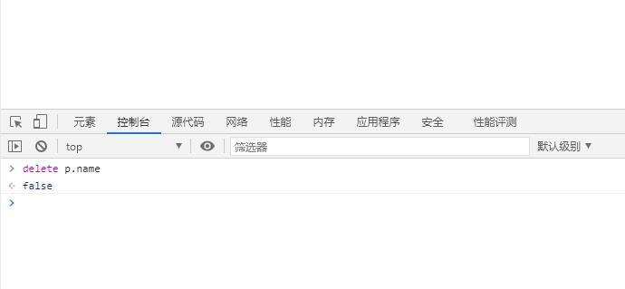
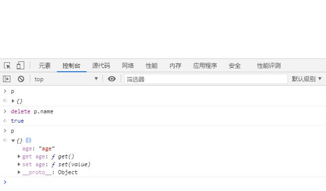
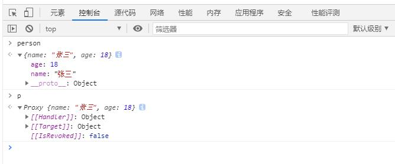
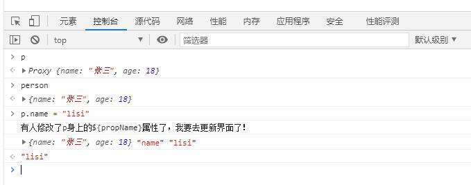
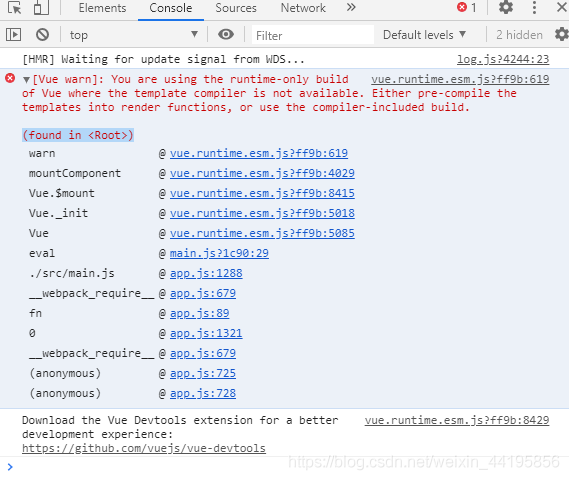

136 尚硅谷
[toc]
# `vue` 基础
## 初识 `Vue`
- 初识`Vue`：
	- 1.想让`Vue`工作，就必须创建一个`Vue`实例，且要传入一个配置对象；
	- 2.`root`容器里的代码依然符合`html`规范，只不过混入了一些特殊的`Vue`语法；
	- 3.`root` 容器里的代码被称为【`Vue`模板】；
	- 4.`Vue`实例和容器是一一对应的；
	- 5.真实开发中只有一个`Vue`实例，并且会配合着组件一起使用；
	- 6.`{{xxx}}`中的`xxx`要写`js`表达式，且`xxx`可以自动读取到`data`中的所有属性；
	- 7.一旦`data`中的数据发生改变，那么页面中用到该数据的地方也会自动更新 ；

	- 注意区分：`js`表达式 和 `js`代码(语句)
		- 1.表达式：一个表达式会产生一个值，可以放在任何一个需要值的地方：
			- (1). `a`
			- (2). `a+b`
			- (3). `demo(1)`
			- (4). `x === y ? 'a' : 'b'`

		- 2.`js`代码(语句)
			- (1). `if(){}`
			- (2). `for(){}`
- 代码：
```html
<!-- 先引入vuejs -->
<!-- 引入Vue -->
<script type="text/javascript" src="../js/vue.js"></script>
```

```html
<!-- <body></body>中准备好一个容器，就是数据渲染展示区域 -->
<div id="demo">
	<h1>Hello，{{name.toUpperCase()}}，{{address}}</h1>
</div>
```

```js
/* script标签中写js */

Vue.config.productionTip = false //阻止 vue 在启动时生成生产提示。

//创建Vue实例
new Vue({
	el:'#demo', //el用于指定当前Vue实例为哪个容器服务，值通常为css选择器字符串。
	data:{ //data中用于存储数据，数据供el所指定的容器去使用，值我们暂时先写成一个对象。
		name:'code',
		address:'北京'
	}
})
```

## `Vue`模板语法有2大类：

- 1.插值语法：

	- **功能**：用于解析标签体内容。
	- **写法**：`{{xxx}}`，`xxx`是`js`表达式，且可以直接读取到`data`中的所有属性。

- 2.指令语法：

	- **功能**：用于解析标签（包括：标签属性、标签体内容、绑定事件.....）。
	- **举例**：`v-bind:href="xxx"` 或  简写为 `:href="xxx"`，`xxx`同样要写`js`表达式，且可以直接读取到data中的所有属性。
	- **备注**：`Vue`中有很多的指令，且形式都是：`v-????`，此处我们只是拿`v-bind`举个例子。
```html
<!-- 准备好一个容器-->
<div id="root">
	<h1>插值语法</h1>
	<h3>你好，{{name}}</h3>
	<hr/>
	<h1>指令语法</h1>
	<a v-bind:href="school.url.toUpperCase()" x="hello">点我去{{school.name}}学习1</a>
	<a :href="school.url" x="hello">点我去{{school.name}}学习2</a>
</div>
```
```js
/* script标签中写js */
Vue.config.productionTip = false //阻止 vue 在启动时生成生产提示。

new Vue({
	el:'#root',
	data:{
		name:'jack',
		school:{
			name:'Jamas',
			url:'http://www.baidu.com',
		}
	}
})
```

## `Vue`中有2种数据绑定的方式：

- 1.**单向绑定(`v-bind`)**：数据只能从`data`流向页面。

- 2.**双向绑定(`v-model`)**：数据不仅能从`data`流向页面，还可以从页面流向`data`。

- **备注**：
	- 1.双向绑定一般都应用在表单类元素上（如：`input`、`select`等）
	- 2.`v-model:value` 可以简写为 `v-model`，因为`v-model`默认收集的就是`value`值。
```html
<div id="root">
	<!-- 普通写法 -->
	<!-- 单向数据绑定：<input type="text" v-bind:value="name"><br/>
	双向数据绑定：<input type="text" v-model:value="name"><br/> -->

	<!-- 简写 -->
	单向数据绑定：<input type="text" :value="name"><br/>
	双向数据绑定：<input type="text" v-model="name"><br/>

	<!-- 如下代码是错误的，因为v-model只能应用在表单类元素（输入类元素）上 -->
	<!-- <h2 v-model:x="name">你好啊</h2> -->
</div>
```

```js
/* script标签中写js */
Vue.config.productionTip = false //阻止 vue 在启动时生成生产提示。

new Vue({
	el:'#root',
	data:{
		name:'尚硅谷'
	}
})
```

## `data`与`el`的2种写法
- 1.`el`有2种写法
	- (1).`new Vue`时候配置`el`属性。
	```js
	new Vue({
		el:'#root', //第一种写法
		data:{
			name:'尚硅谷'
		}
	})
	```
	- (2).先创建`Vue`实例，随后再通过`vm.$mount('#root')`指定`el`的值。
	```js
	const v = new Vue({
		data:{
			name:'尚硅谷'
		}
	})
	console.log(v)
	v.$mount('#root') //第二种写法 */

	```
- 2.`data`有2种写法
	- (1).对象式
	```js
	//data的两种写法
	new Vue({
		el:'#root',
		//data的第一种写法：对象式
		data:{
			name:'code'
		}
	})
	```
	- (2).函数式
	```js
	//data的两种写法
	new Vue({
		el:'#root',
		//data的第二种写法：函数式
		data(){
			console.log('@@@',this) //此处的this是Vue实例对象
			return{
				name:'code'
			}
		}
	})
	```

	> 如何选择：目前哪种写法都可以，以后学习到组件时，`data`必须使用函数式，否则会报错。
- 3.一个重要的原则：
	
	> 由`Vue`管理的函数，一定不要写箭头函数，一旦写了箭头函数，`this`就不再是`Vue`实例了。

## `MVVM`模型
- 1. `M`：模型(`Model`) ：`data`中的数据
- 2. `V`：视图(`View`) ：模板代码
- 3. `VM`：视图模型(`ViewModel`)：`Vue`实例
- 观察发现：
	- 1.`data`中所有的属性，最后都出现在了`vm`身上。
	- 2.`vm`身上所有的属性 及 `Vue`原型上所有属性，在`Vue`模板中都可以直接使用。
	```html
	<!-- 准备好一个容器-->
	<div id="root">
		<h1>学校名称：{{name}}</h1>
		<h1>学校地址：{{address}}</h1>

		<h1>测试一下1：{{1+1}}</h1>

		<!-- `vm`身上所有的属性 及 `Vue`原型上所有属性，在`Vue`模板中都可以直接使用。 -->
		
		<!-- <h1>测试一下2：{{$options}}</h1>
		<h1>测试一下3：{{$emit}}</h1>
		<h1>测试一下4：{{_c}}</h1> -->
	</div>
	```
	```js
	Vue.config.productionTip = false //阻止 vue 在启动时生成生产提示。
	const vm = new Vue({
		el:'#root',
		data:{
			name:'CoderSchool',
			address:'北京',
		}
	})
	console.log(vm)
	```

## 回顾`Object.defineproperty`方法

```js
let number = 18
let person = {
	name:'张三',
	sex:'男',
}

Object.defineProperty(person,'age',{
	// value:18,
	// enumerable:true, //控制属性是否可以枚举，默认值是false

	// writable:true, //控制属性是否可以被修改，默认值是false

	// configurable:true //控制属性是否可以被删除，默认值是false

	//当有人读取person的age属性时，get函数(getter)就会被调用，且返回值就是age的值
	get(){
		console.log('有人读取age属性了')
		return number
	},
	//当有人修改person的age属性时，set函数(setter)就会被调用，且会收到修改的具体值
	set(value){
		console.log('有人修改了age属性，且值是',value)
		number = value
	}
})

/* 遍历对象 */
// console.log(Object.keys(person))

console.log(person)
```

## 何为数据代理
数据代理：通过一个对象代理对另一个对象中属性的操作（读/写）

```js
let obj = {x:100}
let obj2 = {y:200}

Object.defineProperty(obj2,'x',{
	get(){
		return obj.x
	},
	set(value){
		obj.x = value
	}
})
```

## `vue`中的数据代理
- 1.`Vue`中的数据代理：
	- 通过`vm`对象来代理`data`对象中属性的操作（读/写）
- 2.`Vue`中数据代理的好处：
	- 更加方便的操作`data`中的数据
- 3.基本原理：
	- 通过`Object.defineProperty()`把`data`对象中所有属性添加到`vm`上。
	- 为每一个添加到`vm`上的属性，都指定一个`getter`/`setter`。
	- 在`getter`/`setter`内部去操作（读/写）`data`中对应的属性。

## 事件的基本使用：
- 1.使用 `v-on:xxx` 或 `@xxx` 绑定事件，其中`xxx`是事件名；
- 2.事件的回调需要配置在`methods`对象中，最终会在`vm`上；
- 3.`methods`中配置的函数，不要用箭头函数！否则`this`就不是`vm`了；
- 4.`methods`中配置的函数，都是被`Vue`所管理的函数，`this`的指向是`vm` 或 组件实例对象；
- 5.`@click="demo"` 和 `@click="demo($event)"` 效果一致，但后者可以传参；
```html
<!-- 准备好一个容器-->
<div id="root">
	<h2>欢迎来到{{name}}学习</h2>
	<!-- <button v-on:click="showInfo">点我提示信息</button> -->
	<button @click="showInfo1">点我提示信息1（不传参）</button>
	<button @click="showInfo2($event,66)">点我提示信息2（传参）</button>
</div>
```
```js
Vue.config.productionTip = false //阻止 vue 在启动时生成生产提示。

const vm = new Vue({
	el:'#root',
	data:{
		name:'CoderSchool',
	},
	methods:{
		showInfo1(event){
			// console.log(event.target.innerText)
			// console.log(this) //此处的this是vm
			alert('同学你好！')
		},
		showInfo2(event,number){
			console.log(event,number)
			// console.log(event.target.innerText)
			// console.log(this) //此处的this是vm
			alert('同学你好！！')
		}
	}
})
```
## 	`Vue` 中的事件修饰符：
- 1.`prevent`：阻止默认事件（常用）；
- 2.`stop`：阻止事件冒泡（常用）；
- 3.`once`：事件只触发一次（常用）；
- 4.`capture`：使用事件的捕获模式；
- 5.`self`：只有`event.target`是当前操作的元素时才触发事件；
- 6.`passive`：事件的默认行为立即执行，无需等待事件回调执行完毕；
```html
<!-- 准备好一个容器-->
<div id="root">
	<h2>欢迎来到{{name}}学习</h2>
	<!-- 阻止默认事件（常用） -->
	<a href="http://www.atguigu.com" @click.prevent="showInfo">点我提示信息</a>

	<!-- 阻止事件冒泡（常用） -->
	<div class="demo1" @click="showInfo">
		<button @click.stop="showInfo">点我提示信息</button>
		<!-- 修饰符可以连续写 -->
		<!-- <a href="http://www.atguigu.com" @click.prevent.stop="showInfo">点我提示信息</a> -->
	</div>

	<!-- 事件只触发一次（常用） -->
	<button @click.once="showInfo">点我提示信息</button>

	<!-- 使用事件的捕获模式 -->
	<div class="box1" @click.capture="showMsg(1)">
		div1
		<div class="box2" @click="showMsg(2)">
			div2
		</div>
	</div>

	<!-- 只有event.target是当前操作的元素时才触发事件； -->
	<div class="demo1" @click.self="showInfo">
		<button @click="showInfo">点我提示信息</button>
	</div>

	<!-- 事件的默认行为立即执行，无需等待事件回调执行完毕； -->
	<ul @wheel.passive="demo" class="list">
		<li>1</li>
		<li>2</li>
		<li>3</li>
		<li>4</li>
	</ul>

</div>
```

```js
Vue.config.productionTip = false //阻止 vue 在启动时生成生产提示。

new Vue({
	el:'#root',
	data:{
		name:'尚硅谷'
	},
	methods:{
		showInfo(e){
			alert('同学你好！')
			// console.log(e.target)
		},
		showMsg(msg){ 
			console.log(msg)
		},
		demo(){
			for (let i = 0; i < 100000; i++) {
				console.log('#')
			}
			console.log('累坏了')
		}
	}
})
```
## 	`Vue`中常用的按键别名
1.`Vue`中常用的按键别名：
- 回车 => `enter`
- 删除 => `delete` (捕获“删除”和“退格”键)
- 退出 => `esc`
- 空格 => `space`
- 换行 => `tab` (特殊，必须配合`keydown`去使用)
- 上 => `up`
- 下 => `down`
- 左 => `left`
- 右 => `right`
- 2.`Vue`未提供别名的按键，可以使用按键原始的`key`值去绑定，但注意要转为`kebab-case`（短横线命名）
- 3.系统修饰键（用法特殊）：`ctrl`、`alt`、`shift`、`meta`
	- (1).配合`keyup`使用：按下修饰键的同时，再按下其他键，随后释放其他键，事件才被触发。
	- (2).配合`keydown`使用：正常触发事件。
- 4.也可以使用`keyCode`去指定具体的按键（不推荐）
- 5.`Vue.config.keyCodes.自定义键名` = 键码，可以去定制按键别名

```html

```
```js

```
## 计算属性：
- 1.**定义**：要用的属性不存在，要通过已有属性计算得来。
- 2.**原理**：底层借助了`Objcet.defineproperty`方法提供的`getter`和`setter`。
- 3.`get`函数什么时候执行？
	- (1).初次读取时会执行一次。
	- (2).当依赖的数据发生改变时会被再次调用。
- 4.**优势**：与`methods`实现相比，内部有缓存机制（复用），效率更高，调试方便。
- 5.**备注**：
	- 1.计算属性最终会出现在`vm`上，直接读取使用即可。
	- 2.如果计算属性要被修改，那必须写`set`函数去响应修改，且`set`中要引起计算时依赖的数据发生改变。

实现功能：全名=姓+名 （**插值语法**实现）

```html
<!-- 准备好一个容器-->
<div id="root">
	姓：<input type="text" v-model="firstName"> <br/><br/>
	名：<input type="text" v-model="lastName"> <br/><br/>
	全名：<span>{{firstName}}-{{lastName}}</span>
</div>
```
```js
Vue.config.productionTip = false //阻止 vue 在启动时生成生产提示。
new Vue({
	el:'#root',
	data:{
		firstName:'张',
		lastName:'三'
	}
})
```
实现功能：全名=姓+名 （**`methods`** 实现）
```html
<!-- 准备好一个容器-->
<div id="root">
	姓：<input type="text" v-model="firstName"> <br/><br/>
	名：<input type="text" v-model="lastName"> <br/><br/>
	全名：<span>{{fullName()}}</span>
</div>
```
```js
Vue.config.productionTip = false //阻止 vue 在启动时生成生产提示。
new Vue({
	el:'#root',
	data:{
		firstName:'张',
		lastName:'三'
	},
	methods: {
		fullName(){
			console.log('@---fullName')
			return this.firstName + '-' + this.lastName
		}
	},
})
```
实现功能：全名=姓+名 （ **计算属性** 语法实现）
```html
<!-- 准备好一个容器-->
<div id="root">
	姓：<input type="text" v-model="firstName"> <br/><br/>
	名：<input type="text" v-model="lastName"> <br/><br/>
	测试：<input type="text" v-model="x"> <br/><br/>
	全名：<span>{{fullName}}</span> <br/><br/>
	<!-- 全名：<span>{{fullName}}</span> <br/><br/>
	全名：<span>{{fullName}}</span> <br/><br/>
	全名：<span>{{fullName}}</span> -->
</div>
```
```js
Vue.config.productionTip = false //阻止 vue 在启动时生成生产提示。

const vm = new Vue({
	el:'#root',
	data:{
		firstName:'张',
		lastName:'三',
		x:'你好'
	},
	methods: {
		demo(){
			
		}
	},
	computed:{
		fullName:{
			//get有什么作用？当有人读取fullName时，get就会被调用，且返回值就作为fullName的值
			//get什么时候调用？1.初次读取fullName时。2.所依赖的数据发生变化时。
			get(){
				console.log('get被调用了')
				// console.log(this) //此处的this是vm
				return this.firstName + '-' + this.lastName
			},
			//set什么时候调用? 当fullName被修改时。
			set(value){
				console.log('set',value)
				const arr = value.split('-')
				this.firstName = arr[0]
				this.lastName = arr[1]
			}
		}
	}
})
```
实现功能：全名=姓+名 （ **计算属性简写** 语法实现）
```html
<!-- 准备好一个容器-->
<div id="root">
	姓：<input type="text" v-model="firstName"> <br/><br/>
	名：<input type="text" v-model="lastName"> <br/><br/>
	测试：<input type="text" v-model="x"> <br/><br/>
	全名：<span>{{fullName}}</span> <br/><br/>
</div>
```
```js
Vue.config.productionTip = false //阻止 vue 在启动时生成生产提示。
const vm = new Vue({
	el:'#root',
	data:{
		firstName:'张',
		lastName:'三',
	},
	computed:{
		//简写
		fullName(){
			console.log('get被调用了')
			return this.firstName + '-' + this.lastName
		}
	}
})
```
## 绑定样式：
- 1. `class`样式
	- **写法**:`class="xxx"` `xxx`可以是字符串、对象、数组。
	- **字符串写法适用于**：类名不确定，要动态获取。
	- **对象写法适用于**：要绑定多个样式，个数不确定，名字也不确定。
	- **数组写法适用于**：要绑定多个样式，个数确定，名字也确定，但不确定用不用。
- 2. `style`样式
		- `:style="{fontSize: xxx}"`其中`xxx`是动态值。
		- `:style="[a,b]"`其中`a`、`b`是样式对象。绑定样式：
	- 1. `class`样式
		- **写法**:`class="xxx"` `xxx`可以是字符串、对象、数组。
		- **字符串写法适用于**：类名不确定，要动态获取。
		- **对象写法适用于**：要绑定多个样式，个数不确定，名字也不确定。
		- **数组写法适用于**：要绑定多个样式，个数确定，名字也确定，但不确定用不用。
	- 2. `style`样式
		- `:style="{fontSize: xxx}"` 其中`xxx`是动态值。
		- `:style="[a,b]"` 其中`a`、`b`是样式对象。

## 条件渲染：
- 1.`v-if`
	写法：
	- (1).`v-if="表达式"` 
	- (2).`v-else-if="表达式"`
	- (3).`v-else="表达式"`
	- 适用于：切换频率较低的场景。
	- 特点：不展示的`DOM`元素直接被移除。
	- 注意：`v-if`可以和:`v-else-if`、`v-else`一起使用，但要求结构不能被“打断”。

- 2.`v-show`
	- 写法：`v-show="表达式"`
	- 适用于：切换频率较高的场景。
	- 特点：不展示的`DOM`元素未被移除，仅仅是使用样式隐藏掉
	
- 3.备注：使用`v-if`的时，元素可能无法获取到，而使用`v-show`一定可以获取到。

## `v-for`指令:
- 1.用于展示列表数据
- 2.语法：`v-for="(item, index) in xxx" :key="yyy"`
- 3.可遍历：数组、对象、字符串（用的很少）、指定次数（用的很少）

## 面试题：`react`、`vue`中的`key`有什么作用？（`key`的内部原理）

- 1. 虚拟`DOM`中`key`的作用：
	- `key`是虚拟`DOM`对象的标识，当数据发生变化时，`Vue`会根据【新数据】生成【新的虚拟`DOM`】, 
	- 随后`Vue`进行【新虚拟`DOM`】与【旧虚拟`DOM`】的差异比较，比较规则如下：
	
- 2.对比规则：
	- (1).旧虚拟`DOM`中找到了与新虚拟`DOM`相同的`key`：
		- 若虚拟`DOM`中内容没变, 直接使用之前的真实`DOM`！
		- 若虚拟`DOM`中内容变了, 则生成新的真实`DOM`，随后替换掉页面中之前的真实`DOM`。

	- (2).旧虚拟`DOM`中未找到与新虚拟`DOM`相同的`key`
		创建新的真实`DOM`，随后渲染到到页面。
	
- 3. 用`index`作为`key`可能会引发的问题：
	1. 若对数据进行：逆序添加、逆序删除等破坏顺序操作:
		会产生没有必要的真实`DOM`更新 ==> 界面效果没问题, 但效率低。

	2. 如果结构中还包含输入类的`DOM`：
		会产生错误`DOM`更新 ==> 界面有问题。

- 4. 开发中如何选择`key`?:
		- 1.最好使用每条数据的唯一标识作为`key`, 比如`id`、手机号、身份证号、学号等唯一值。
		- 2.如果不存在对数据的逆序添加、逆序删除等破坏顺序操作，仅用于渲染列表用于展示，
		使用`index`作为`key`是没有问题的。

## `Vue`监视数据的原理：
- 1. `vue`会监视`data`中所有层次的数据。

- 2. 如何监测对象中的数据？
	通过`setter`实现监视，且要在`new Vue`时就传入要监测的数据。
	- (1).对象中后追加的属性，`Vue`默认不做响应式处理
	- (2).如需给后添加的属性做响应式，请使用如下`API`：
		- `Vue.set(target，propertyName/index，value)` 或 
		- `vm.$set(target，propertyName/index，value)`

- 3. 如何监测数组中的数据？
	通过包裹数组更新元素的方法实现，本质就是做了两件事：
	- (1).调用原生对应的方法对数组进行更新。
	- (2).重新解析模板，进而更新页面。

- 4.在`Vue`修改数组中的某个元素一定要用如下方法：
	- 1.使用这些`API`:`push()`、`pop()`、`shift()`、`unshift()`、`splice()`、`sort()`、`reverse()`
	- 2.`Vue.set()` 或 `vm.$set()`

- 特别注意：`Vue.set()` 和 `vm.$set()` 不能给`vm` 或 `vm`的根数据对象 添加属性！！！

## 	收集表单数据：
- 若：`<input type="text"/>`，则`v-model`收集的是`value`值，用户输入的就是`value`值。
- 若：`<input type="radio"/>`，则`v-model`收集的是`value`值，且要给标签配置`value`值。
- 若：`<input type="checkbox"/>`
	- 1.没有配置`input`的`value`属性，那么收集的就是`checked`（勾选 `or` 未勾选，是布尔值）
	- 2.配置`input`的`value`属性:
		- (1)`v-model`的初始值是非数组，那么收集的就是`checked`（勾选 `or `未勾选，是布尔值）
		- (2)`v-model`的初始值是数组，那么收集的的就是`value`组成的数组

- 备注：`v-model`的三个修饰符：
	- `lazy`：失去焦点再收集数据
	- `number`：输入字符串转为有效的数字
	- `trim`：输入首尾空格过滤

## 过滤器：
- 定义：对要显示的数据进行特定格式化后再显示（适用于一些简单逻辑的处理）。
- 语法：
	- 1.注册过滤器：`Vue.filter(name,callback)` 或 `new Vue{filters:{}}`
	- 2.使用过滤器：`{{ xxx | 过滤器名}} ` 或  `v-bind:属性 = "xxx | 过滤器名"`
- 备注：
	- 1.过滤器也可以接收额外参数、多个过滤器也可以串联
	- 2.并没有改变原本的数据, 是产生新的对应的数据

## 	我们学过的指令：
- `v-bind`	: 单向绑定解析表达式, 可简写为 `:xxx`
- `v-model`	: 双向数据绑定
- `v-for`  	: 遍历数组/对象/字符串
- `v-on `  	: 绑定事件监听, 可简写为`@`
- `v-if` 	: 条件渲染（动态控制节点是否存存在）
- `v-else` 	: 条件渲染（动态控制节点是否存存在）
- `v-show` 	: 条件渲染 (动态控制节点是否展示)
- `v-text`指令：
	- 1.作用：向其所在的节点中渲染文本内容。
	- 2.与插值语法的区别：`v-text`会替换掉节点中的内容，`{{xx}}`则不会。

## `v-html`指令：
- 1.作用：向指定节点中渲染包含`html`结构的内容。
- 2.与插值语法的区别：
	- (1).`v-html`会替换掉节点中所有的内容，`{{xx}}`则不会。
	- (2).`v-html`可以识别`html`结构。
- 3.严重注意：`v-html`有安全性问题！！！！
	- (1).在网站上动态渲染任意`HTML`是非常危险的，容易导致`XSS`攻击。
	- (2).一定要在可信的内容上使用`v-html`，永不要用在用户提交的内容上！

## `v-cloak`指令（没有值）：
- 1.本质是一个特殊属性，`Vue`实例创建完毕并接管容器后，会删掉`v-cloak`属性。
- 2.使用`css`配合`v-cloak`可以解决网速慢时页面展示出`{{xxx}}`的问题。

## `v-once`指令：
- 1.`v-once`所在节点在初次动态渲染后，就视为静态内容了。
- 2.以后数据的改变不会引起`v-once`所在结构的更新，可以用于优化性能。

## `v-pre`指令：
- 1.跳过其所在节点的编译过程。
- 2.可利用它跳过：没有使用指令语法、没有使用插值语法的节点，会加快编译。

## 自定义指令
需求1：定义一个`v-big`指令，和`v-text`功能类似，但会把绑定的数值放大10倍。
需求2：定义一个`v-fbind`指令，和`v-bind`功能类似，但可以让其所绑定的`input`元素默认获取焦点。
自定义指令总结：
- 一、定义语法：
	- (1).局部指令：
	```js
	new Vue({
		directives:{指令名:配置对象} 
	})
	```
	或
	```js
	new Vue({
		directives{指令名:回调函数}
	})
	```
	- (2).全局指令：
	`Vue.directive(指令名,配置对象)` 或   `Vue.directive(指令名,回调函数)`

- 二、配置对象中常用的3个回调：
	- (1).`bind`：指令与元素成功绑定时调用。
	- (2).`inserted`：指令所在元素被插入页面时调用。
	- (3).`update`：指令所在模板结构被重新解析时调用。

- 三、备注：
	- 1.指令定义时不加`v-`，但使用时要加`v-`；
	- 2.指令名如果是多个单词，要使用`kebab-case`命名方式，不要用`camelCase`命名。

## 	生命周期：
- 1.又名：生命周期回调函数、生命周期函数、生命周期钩子。
- 2.是什么：`Vue`在关键时刻帮我们调用的一些特殊名称的函数。
- 3.生命周期函数的名字不可更改，但函数的具体内容是程序员根据需求编写的。
- 4.生命周期函数中的`this`指向是`vm` 或 组件实例对象。

## 常用的生命周期钩子：
- 1.`mounted`: 发送`ajax`请求、启动定时器、绑定自定义事件、订阅消息等【初始化操作】。
- 2.`beforeDestroy`: 清除定时器、解绑自定义事件、取消订阅消息等【收尾工作】。

## 关于销毁`Vue`实例
- 1.销毁后借助`Vue`开发者工具看不到任何信息。
- 2.销毁后自定义事件会失效，但原生`DOM`事件依然有效。
- 3.一般不会在`beforeDestroy`操作数据，因为即便操作数据，也不会再触发更新流程了。

## 	`Vue`中使用组件的三大步骤：

- 一、如何定义一个组件？
	- 使用`Vue.extend(options)`创建，其中`options`和`new Vue(options)`时传入的那个`options`几乎一样，但也有点区别；
	- 区别如下：
		- 1.`el`不要写，为什么？ ——— 最终所有的组件都要经过一个`vm`的管理，由`vm`中的`el`决定服务哪个容器。
		- 2.`data`必须写成函数，为什么？ ———— 避免组件被复用时，数据存在引用关系。
		- 备注：使用`template`可以配置组件结构。

- 二、如何注册组件？
	- 1.局部注册：靠`new Vue`的时候传入`components`选项
	- 2.全局注册：靠`Vue.component('组件名',组件)`

- 三、编写组件标签：`<school></school>`

## 几个注意点：
- 1.关于组件名:
	- 一个单词组成：
		- 第一种写法(首字母小写)：`school`
		- 第二种写法(首字母大写)：`School`
	- 多个单词组成：
		- 第一种写法(`kebab-case`命名)：`my-school`
		- 第二种写法(`CamelCase`命名)：`MySchool `(需要`Vue`脚手架支持)
	- 备注：
		- (1).组件名尽可能回避`HTML`中已有的元素名称，例如：`h2`、`H2`都不行。
		- (2).可以使用`name`配置项指定组件在开发者工具中呈现的名字。

- 2.关于组件标签:
	- 第一种写法：`<school></school>`
	- 第二种写法：`<school/>`
	- 备注：不用使用脚手架时，`<school/>`会导致后续组件不能渲染。

- 3.一个简写方式：
	- `const school = Vue.extend(options)` 可简写为：`const school = options`

## 关于`VueComponent`：
- 1.`school`组件本质是一个名为`VueComponent`的构造函数，且不是程序员定义的，是`Vue.extend`生成的。

- 2.我们只需要写`<school/>`或`<school></school>`，`Vue`解析时会帮我们创建`school`组件的实例对象，
	即`Vue`帮我们执行的：`new VueComponent(options)`。

- 3.特别注意：每次调用`Vue.extend`，返回的都是一个全新的`VueComponent`！！！！

- 4.关于`this`指向：
	- (1).组件配置中：
	> `data`函数、`methods`中的函数、`watch`中的函数、`computed`中的函数 它们的`this`均是【`VueComponent`实例对象】。
	- (2).`new Vue(options)`配置中：
	> `data`函数、`methods`中的函数、`watch`中的函数、`computed`中的函数 它们的`this`均是【`Vue`实例对象】。

- 5.`VueComponent`的实例对象，以后简称`vc`（也可称之为：组件实例对象）。
	`Vue`的实例对象，以后简称`vm`。

## 单文件组件（格式：`xxx.vue` ）
浏览器怎么识别 `xxx.vue` 这格式的文件？
- `webpack` 一些 `loader` 
- 脚手架
- 文件名命名格式： `MySchool.vue` 或者 `School.vue`
- 安装 `vetur`插件  高亮显式这个文件格式内的代码 快速生成代码快捷键 `<v`

```vue
<template>
	<div class="demo">
		<h2>学校名称：{{name}}</h2>
		<h2>学校地址：{{address}}</h2>
		<button @click="showName">点我提示学校名</button>	
	</div>
</template>

<script>
	 export default {
		name:'School',
		data(){
			return {
				name:'CoderSchool',
				address:'北京'
			}
		},
		methods: {
			showName(){
				alert(this.name)
			}
		},
	}
</script>

<style>
	.demo{
		background-color: orange;
	}
</style>
```

# 笔记
## 3.1 初始化脚手架

### 3.1.1 说明

- `vue` 脚手架是`vue` 官方提供的标准化开发工具（开发平台）
- 最新的版本是`4.x`
- 文档是：https://cli.vuejs.org.zh

### 3.1.2 具体步骤

- 第一步：（仅第一次执行）：全局安装`@vue/cli`

  ```shell
  npm install -g @vue/cli
  ```

- 第二步：<font color="red">切换到你要创建的项目的目录</font>，然后使用命令创建项目

  ```shell
  vue create xxx
  ```

- 第三步：

  ```shell
  cd  xxxx  
  npm run serve
  ```

- <font color="red">备注</font>：

  - 如出现下载缓慢清配置 `npm` 淘宝镜像 ：

  ```shell
  npm config set registry https//registry.npm.taobao.org
  ```

  - 脚手架隐藏了所有 <font color="red">`webpack`</font> 相关配置，若想查看具体<font color="red"> `webpack`</font> 配置，请执行

  ```shell
  vue inspect > output.js
  ```

## `render` 函数

`vue` 有两部分组成： 核心 + 模板解析器

`render` 函数必须要有返回值,创建具体元素，相当于解析`template`

```js
new Vue({
	el:"#app",

	render(createElement){
		console.log("888")
		return createElement('h1','Hello')
	},

	//rander: h=>h('App')

	// template:`<h1>Hello</h1>`,
	components:{ App }
})

```

## 脚手架文件结构
`vue/cli` (`cli` ----`command line interface`)

	├── node_modules 
	├── public
	│   ├── favicon.ico: 页签图标
	│   └── index.html: 主页面
	├── src
	│   ├── assets: 存放静态资源
	│   │   └── logo.png
	│   │── component: 存放组件
	│   │   └── HelloWorld.vue
	│   │── App.vue: 汇总所有组件
	│   │── main.js: 入口文件
	├── .gitignore: git版本管制忽略的配置
	├── babel.config.js: babel的配置文件
	├── package.json: 应用包配置文件 
	├── README.md: 应用描述文件
	├── package-lock.json：包版本控制文件

## 关于不同版本的`Vue`

1. `vue.js`与`vue.runtime.xxx.js`的区别：
   1. `vue.js`是完整版的`Vue`，包含：核心功能 + 模板解析器。
   2. `vue.runtime.xxx.js`是运行版的`Vue`，只包含：核心功能；没有模板解析器。
2. 因为`vue.runtime.xxx.js`没有模板解析器，所以不能使用`template`这个配置项，需要使用`render`函数接收到的`createElement`函数去指定具体内容。

## `vue.config.js`配置文件

1. 使用`vue inspect` > `output.js`可以查看到Vue脚手架的默认配置。
2. 使用`vue.config.js`可以对脚手架进行个性化定制，详情见：https://cli.vuejs.org/zh

## `ref`属性

1. 被用来给<font color="red">元素</font>或<font color="red">子组件</font>注册引用信息（`id`的替代者）
2. 应用在`html`标签上获取的是真实DOM元素，应用在组件标签上是组件实例对象（`vc`）
3. 使用方式：
   1. 打标识：```<h1 ref="xxx">.....</h1>``` 或 ```<School ref="xxx"></School>```
   2. 获取：```this.$refs.xxx```

## `props`配置项

1. 功能：让组件接收外部传过来的数据

2. 传递数据：```<Demo name="xxx"/>```

3. 接收数据：

   1. 第一种方式（只接收）：```props:['name'] ```

   2. 第二种方式（限制类型）：```props:{name:String}```

   3. 第三种方式（限制类型、限制必要性、指定默认值）：

      ```js
      props:{
      	name:{
      	type:String, //类型
      	required:true, //必要性
      	default:'老王' //默认值
      	}
      }
      ```

   > <font color="red">**备注**：</font>
   >
   > <font color="red">`props`是只读的，`Vue`底层会监测你对`props`的修改，如果进行了修改，就会发出警告，</font>
   >
   > <font color="red">若业务需求确实需要修改，那么请复制`props`的内容到`data`中一份，然后去修改`data`中的数据。</font>
   >
   > ```js
   > props:['name','age','sex']
   > 
   > data(){
   >     console.log(this)//打印 vm
   >     return {
   >         msg:"子组件"，
   >         myAge:this.age
   >     }
   > }
   > methods:{
   >     changeMyAge(){
   >        this.age ++
   >     }
   > }
   > ```
   >
   > 

## `mixin`(混入)

1. 功能：可以把多个组件共用的配置提取成一个混入对象

2. 使用方式：

   第一步定义混合：

   ```js
   {
       data(){
           //....
       },
       methods:{
           //....
       }
       ....
   }
   ```

   第二步使用混入：

   ​	-  在`main.js` 文件中全局混入：

   `import {  xxx1,xxx2 } from './mixin'` 

   `Vue.mixin(xxx)`

   	- 在使用的组件中引入，局部混入：

   `import {  xxx1,xxx2 } from './mixin'`

   `mixins:['xxx']`

   

   注意： 如果混入的变量 和定义的同名或者重复，以组件的为主，混入的无效

## 插件`plugins`

1. 功能：用于增强`Vue`

2. 本质：包含`install`方法的一个**对象**，`install`的第一个参数是`Vue`，第二个以后的参数是插件使用者传递的数据。

3. 定义插件：

   ```js
   对象.install = function (Vue, options) {
       // 1. 添加全局过滤器
       Vue.filter(....)
   
       // 2. 添加全局指令
       Vue.directive(....)
   
       // 3. 配置全局混入(合)
       Vue.mixin(....)
   
       // 4. 添加实例方法
       Vue.prototype.$myMethod = function () {...}
       Vue.prototype.$myProperty = xxxx
   }
   ```

   ```js
   export default {
       install(Vue){
           // 1. 添加全局过滤器
       	Vue.filter(....)
   
       	// 2. 添加全局指令
       	Vue.directive(....)
   
       	// 3. 配置全局混入(合)
       	Vue.mixin(....)
   
       	// 4. 添加实例方法
       	Vue.prototype.$myMethod = function () {...}
       	Vue.prototype.$myProperty = xxxx
       }
   }
   ```

   

4. 在`main.js`中 引入插件：```import plugins from './plugins'```

5. 在`main.js`中 使用插件：```Vue.use()```

## `scoped`样式

1. 作用：让样式在局部生效，防止冲突。
2. 写法：```<style scoped>```
3. `App`组件不适用
4. `vue/cli` 使用的是`webpack 4.46.0`   直接安装`less-loader`会出现版本不适用的报错。所以需要降低`less-loader `,使用命令 `npm view webpack versions`即可查询`webpack`所有版本号

## 总结`TodoList`案例

1. 组件化编码流程：

   ​	(1).拆分静态组件：组件要按照功能点拆分，命名不要与`html`元素冲突。

   ​	(2).实现动态组件：考虑好数据的存放位置，数据是一个组件在用，还是一些组件在用：

   ​			1).一个组件在用：放在组件自身即可。

   ​			2). 一些组件在用：放在他们共同的父组件上（<span style="color:red">状态提升</span>）。

   ​	(3).实现交互：从绑定事件开始。

2. `props`适用于：

   ​	(1).父组件 ==> 子组件 通信

   ​	(2).子组件 ==> 父组件 通信（要求父先给子一个函数）

3. 使用`v-model`时要切记：`v-model`绑定的值不能是`props`传过来的值，因为`props`是不可以修改的！

4. `props`传过来的若是对象类型的值，修改对象中的属性时`Vue`不会报错，但不推荐这样做。

## `webStorage`

1. 存储内容大小一般支持5MB左右（不同浏览器可能还不一样）

2. 浏览器端通过 `Window.sessionStorage` 和 `Window.localStorage` 属性来实现本地存储机制。

3. 相关`API`：

   1. ```xxxxxStorage.setItem('key', 'value');```
      	该方法接受一个键和值作为参数，会把键值对添加到存储中，如果键名存在，则更新其对应的值。

   2. ```xxxxxStorage.getItem('person');```

      ​		该方法接受一个键名作为参数，返回键名对应的值。

   3. ```xxxxxStorage.removeItem('key');```

      ​		该方法接受一个键名作为参数，并把该键名从存储中删除。

   4. ``` xxxxxStorage.clear()```

      ​		该方法会清空存储中的所有数据。

4. 备注：

   1. `SessionStorage`存储的内容会随着浏览器窗口关闭而消失。
   2. `LocalStorage`存储的内容，需要手动清除才会消失。
   3. ```xxxxxStorage.getItem(xxx)```如果`xxx`对应的`value`获取不到，那么`getItem`的返回值是`null`。
   4. ```JSON.parse(null)```的结果依然是`null`。

## 组件的自定义事件

1. 一种组件间通信的方式，适用于：<strong style="color:red">子组件 ===> 父组件</strong>

2. 使用场景：`A`是父组件，`B`是子组件，`B`想给`A`传数据，那么就要在`A`中给`B`绑定自定义事件（<span style="color:red">事件的回调在A中</span>`）。

3. 绑定自定义事件：

   1. 第一种方式，在父组件中：```<Demo @atguigu="test"/>```  或 ```<Demo v-on:atguigu="test"/>```

   2. 第二种方式，在父组件中：

      ```js
      <Demo ref="demo"/>
      //......
      mounted(){
         this.$refs.xxx.$on('atguigu',this.test)
      }
      ```

   3. 若想让自定义事件只能触发一次，可以使用```once```修饰符，或```$once```方法。

4. 触发自定义事件：```this.$emit('atguigu',数据)```		

5. 解绑自定义事件```this.$off('atguigu')```

6. 组件上也可以绑定原生DOM事件，需要使用```native```修饰符。

7. 注意：通过```this.$refs.xxx.$on('atguigu',回调)```绑定自定义事件时，回调<span style="color:red">要么配置在methods中</span>，<span style="color:red">要么用箭头函数</span>，否则this指向会出问题！

## 全局事件总线（GlobalEventBus）

1. 一种组件间通信的方式，适用于<span style="color:red">任意组件间通信</span>。

2. 安装全局事件总线：

   ```js
   new Vue({
   	......
   	beforeCreate() {
   		Vue.prototype.$bus = this //安装全局事件总线，$bus就是当前应用的vm
   	},
       ......
   }) 
   ```

3. 使用事件总线：

   1. 接收数据：A组件想接收数据，则在A组件中给$bus绑定自定义事件，事件的<span style="color:red">回调留在A组件自身。</span>

      ```js
      methods(){
        demo(data){......}
      }
      ......
      mounted() {
        this.$bus.$on('xxxx',this.demo)
      }
      ```

   2. 提供数据：```this.$bus.$emit('xxxx',数据)```

4. 最好在beforeDestroy钩子中，用$off去解绑<span style="color:red">当前组件所用到的</span>事件。

## 消息订阅与发布（pubsub）

1. 一种组件间通信的方式，适用于<span style="color:red">任意组件间通信</span>。

2. 使用步骤：

   1. 安装pubsub：```npm i pubsub-js```

   2. 引入: ```import pubsub from 'pubsub-js'```

   3. 接收数据：A组件想接收数据，则在A组件中订阅消息，订阅的<span style="color:red">回调留在A组件自身。</span>

      ```js
      methods(){
        demo(data){......}
      }
      ......
      mounted() {
        this.pid = pubsub.subscribe('xxx',this.demo) //订阅消息
      }
      ```

   4. 提供数据：```pubsub.publish('xxx',数据)```

   5. 最好在beforeDestroy钩子中，用```PubSub.unsubscribe(pid)```去<span style="color:red">取消订阅。</span>

## nextTick

1. 语法：```this.$nextTick(回调函数)```
2. 作用：在下一次 DOM 更新结束后执行其指定的回调。
3. 什么时候用：当改变数据后，要基于更新后的新DOM进行某些操作时，要在nextTick所指定的回调函数中执行。

## Vue封装的过度与动画

1. 作用：在插入、更新或移除 DOM元素时，在合适的时候给元素添加样式类名。

2. 图示：

3. 写法：

   1. 准备好样式：

      - 元素进入的样式：
        1. v-enter：进入的起点
        2. v-enter-active：进入过程中
        3. v-enter-to：进入的终点
      - 元素离开的样式：
        1. v-leave：离开的起点
        2. v-leave-active：离开过程中
        3. v-leave-to：离开的终点

   2. 使用```<transition>```包裹要过度的元素，并配置name属性：

      ```vue
      <transition name="hello">
      	<h1 v-show="isShow">你好啊！</h1>
      </transition>
      ```

   3. 备注：若有多个元素需要过度，则需要使用：```<transition-group>```，且每个元素都要指定```key```值。

## vue脚手架配置代理

### 方法一

​	在vue.config.js中添加如下配置：

```js
devServer:{
  proxy:"http://localhost:5000"
}
```

说明：

1. 优点：配置简单，请求资源时直接发给前端（8080）即可。
2. 缺点：不能配置多个代理，不能灵活的控制请求是否走代理。
3. 工作方式：若按照上述配置代理，当请求了前端不存在的资源时，那么该请求会转发给服务器 （优先匹配前端资源）

### 方法二

​	编写vue.config.js配置具体代理规则：

```js
module.exports = {
	devServer: {
      proxy: {
      '/api1': {// 匹配所有以 '/api1'开头的请求路径
        target: 'http://localhost:5000',// 代理目标的基础路径
        changeOrigin: true,
        pathRewrite: {'^/api1': ''}
      },
      '/api2': {// 匹配所有以 '/api2'开头的请求路径
        target: 'http://localhost:5001',// 代理目标的基础路径
        changeOrigin: true,
        pathRewrite: {'^/api2': ''}
      }
    }
  }
}
/*
   changeOrigin设置为true时，服务器收到的请求头中的host为：localhost:5000
   changeOrigin设置为false时，服务器收到的请求头中的host为：localhost:8080
   changeOrigin默认值为true
*/
```

说明：

1. 优点：可以配置多个代理，且可以灵活的控制请求是否走代理。
2. 缺点：配置略微繁琐，请求资源时必须加前缀。

## 插槽

1. 作用：让父组件可以向子组件指定位置插入html结构，也是一种组件间通信的方式，适用于 <strong style="color:red">父组件 ===> 子组件</strong> 。

2. 分类：默认插槽、具名插槽、作用域插槽

3. 使用方式：

   1. 默认插槽：

      ```vue
      父组件中：
              <Category>
                 <div>html结构1</div>
              </Category>
      子组件中：
              <template>
                  <div>
                     <!-- 定义插槽 -->
                     <slot>插槽默认内容...</slot>
                  </div>
              </template>
      ```

   2. 具名插槽：

      ```vue
      父组件中：
              <Category>
                  <template slot="center">
                    <div>html结构1</div>
                  </template>
      
                  <template v-slot:footer>
                     <div>html结构2</div>
                  </template>
              </Category>
      子组件中：
              <template>
                  <div>
                     <!-- 定义插槽 -->
                     <slot name="center">插槽默认内容...</slot>
                     <slot name="footer">插槽默认内容...</slot>
                  </div>
              </template>
      ```

   3. 作用域插槽：

      1. 理解：<span style="color:red">数据在组件的自身，但根据数据生成的结构需要组件的使用者来决定。</span>（games数据在Category组件中，但使用数据所遍历出来的结构由App组件决定）

      2. 具体编码：

         ```vue
         父组件中：
         		<Category>
         			<template scope="scopeData">
         				<!-- 生成的是ul列表 -->
         				<ul>
         					<li v-for="g in scopeData.games" :key="g">{{g}}</li>
         				</ul>
         			</template>
         		</Category>
         
         		<Category>
         			<template slot-scope="scopeData">
         				<!-- 生成的是h4标题 -->
         				<h4 v-for="g in scopeData.games" :key="g">{{g}}</h4>
         			</template>
         		</Category>
         子组件中：
                 <template>
                     <div>
                         <slot :games="games"></slot>
                     </div>
                 </template>
         		
                 <script>
                     export default {
                         name:'Category',
                         props:['title'],
                         //数据在子组件自身
                         data() {
                             return {
                                 games:['红色警戒','穿越火线','劲舞团','超级玛丽']
                             }
                         },
                     }
                 </script>
         ```

   ```
   
   ```

## Vuex

### 1.概念

​		在Vue中实现集中式状态（数据）管理的一个Vue插件，对vue应用中多个组件的共享状态进行集中式的管理（读/写），也是一种组件间通信的方式，且适用于任意组件间通信。

### 2.何时使用？

​		多个组件需要共享数据时

### 3.搭建vuex环境

1. 创建文件：```src/store/index.js```

   ```js
   //引入Vue核心库
   import Vue from 'vue'
   //引入Vuex
   import Vuex from 'vuex'
   //应用Vuex插件
   Vue.use(Vuex)
   
   //准备actions对象——响应组件中用户的动作
   const actions = {}
   //准备mutations对象——修改state中的数据
   const mutations = {}
   //准备state对象——保存具体的数据
   const state = {}
   
   //创建并暴露store
   export default new Vuex.Store({
   	actions,
   	mutations,
   	state
   })
   ```

2. 在```main.js```中创建vm时传入```store```配置项

   ```js
   ......
   //引入store
   import store from './store'
   ......
   
   //创建vm
   new Vue({
   	el:'#app',
   	render: h => h(App),
   	store
   })
   ```

###    4.基本使用

1. 初始化数据、配置```actions```、配置```mutations```，操作文件```store.js```

   ```js
   //引入Vue核心库
   import Vue from 'vue'
   //引入Vuex
   import Vuex from 'vuex'
   //引用Vuex
   Vue.use(Vuex)
   
   const actions = {
       //响应组件中加的动作
   	jia(context,value){
   		// console.log('actions中的jia被调用了',miniStore,value)
   		context.commit('JIA',value)
   	},
   }
   
   const mutations = {
       //执行加
   	JIA(state,value){
   		// console.log('mutations中的JIA被调用了',state,value)
   		state.sum += value
   	}
   }
   
   //初始化数据
   const state = {
      sum:0
   }
   
   //创建并暴露store
   export default new Vuex.Store({
   	actions,
   	mutations,
   	state,
   })
   ```

2. 组件中读取vuex中的数据：```$store.state.sum```

3. 组件中修改vuex中的数据：```$store.dispatch('action中的方法名',数据)``` 或 ```$store.commit('mutations中的方法名',数据)```

   >  备注：若没有网络请求或其他业务逻辑，组件中也可以越过actions，即不写```dispatch```，直接编写```commit```

### 5.getters的使用

1. 概念：当state中的数据需要经过加工后再使用时，可以使用getters加工。

2. 在```store.js```中追加```getters```配置

   ```js
   ......
   
   const getters = {
   	bigSum(state){
   		return state.sum * 10
   	}
   }
   
   //创建并暴露store
   export default new Vuex.Store({
   	......
   	getters
   })
   ```

3. 组件中读取数据：```$store.getters.bigSum```

### 6.四个map方法的使用

1. <strong>mapState方法：</strong>用于帮助我们映射```state```中的数据为计算属性

   ```js
   computed: {
       //借助mapState生成计算属性：sum、school、subject（对象写法）
        ...mapState({sum:'sum',school:'school',subject:'subject'}),
            
       //借助mapState生成计算属性：sum、school、subject（数组写法）
       ...mapState(['sum','school','subject']),
   },
   ```

2. <strong>mapGetters方法：</strong>用于帮助我们映射```getters```中的数据为计算属性

   ```js
   computed: {
       //借助mapGetters生成计算属性：bigSum（对象写法）
       ...mapGetters({bigSum:'bigSum'}),
   
       //借助mapGetters生成计算属性：bigSum（数组写法）
       ...mapGetters(['bigSum'])
   },
   ```

3. <strong>mapActions方法：</strong>用于帮助我们生成与```actions```对话的方法，即：包含```$store.dispatch(xxx)```的函数

   ```js
   methods:{
       //靠mapActions生成：incrementOdd、incrementWait（对象形式）
       ...mapActions({incrementOdd:'jiaOdd',incrementWait:'jiaWait'})
   
       //靠mapActions生成：incrementOdd、incrementWait（数组形式）
       ...mapActions(['jiaOdd','jiaWait'])
   }
   ```

4. <strong>mapMutations方法：</strong>用于帮助我们生成与```mutations```对话的方法，即：包含```$store.commit(xxx)```的函数

   ```js
   methods:{
       //靠mapActions生成：increment、decrement（对象形式）
       ...mapMutations({increment:'JIA',decrement:'JIAN'}),
       
       //靠mapMutations生成：JIA、JIAN（对象形式）
       ...mapMutations(['JIA','JIAN']),
   }
   ```

> 备注：mapActions与mapMutations使用时，若需要传递参数需要：在模板中绑定事件时传递好参数，否则参数是事件对象。

### 7.模块化+命名空间

1. 目的：让代码更好维护，让多种数据分类更加明确。

2. 修改```store.js```

   ```javascript
   const countAbout = {
     namespaced:true,//开启命名空间
     state:{x:1},
     mutations: { ... },
     actions: { ... },
     getters: {
       bigSum(state){
          return state.sum * 10
       }
     }
   }
   
   const personAbout = {
     namespaced:true,//开启命名空间
     state:{ ... },
     mutations: { ... },
     actions: { ... }
   }
   
   const store = new Vuex.Store({
     modules: {
       countAbout,
       personAbout
     }
   })
   ```

3. 开启命名空间后，组件中读取state数据：

   ```js
   //方式一：自己直接读取
   this.$store.state.personAbout.list
   //方式二：借助mapState读取：
   ...mapState('countAbout',['sum','school','subject']),
   ```

4. 开启命名空间后，组件中读取getters数据：

   ```js
   //方式一：自己直接读取
   this.$store.getters['personAbout/firstPersonName']
   //方式二：借助mapGetters读取：
   ...mapGetters('countAbout',['bigSum'])
   ```

5. 开启命名空间后，组件中调用dispatch

   ```js
   //方式一：自己直接dispatch
   this.$store.dispatch('personAbout/addPersonWang',person)
   //方式二：借助mapActions：
   ...mapActions('countAbout',{incrementOdd:'jiaOdd',incrementWait:'jiaWait'})
   ```

6. 开启命名空间后，组件中调用commit

   ```js
   //方式一：自己直接commit
   this.$store.commit('personAbout/ADD_PERSON',person)
   //方式二：借助mapMutations：
   ...mapMutations('countAbout',{increment:'JIA',decrement:'JIAN'}),
   ```

 ## 路由

1. 理解： 一个路由（route）就是一组映射关系（key - value），多个路由需要路由器（router）进行管理。
2. 前端路由：key是路径，value是组件。

### 1.基本使用

1. 安装vue-router，命令：```npm i vue-router```

2. 应用插件：```Vue.use(VueRouter)```

3. 编写router配置项:

   ```js
   //引入VueRouter
   import VueRouter from 'vue-router'
   //引入Luyou 组件
   import About from '../components/About'
   import Home from '../components/Home'
   
   //创建router实例对象，去管理一组一组的路由规则
   const router = new VueRouter({
   	routes:[
   		{
   			path:'/about',
   			component:About
   		},
   		{
   			path:'/home',
   			component:Home
   		}
   	]
   })
   
   //暴露router
   export default router
   ```

4. 实现切换（active-class可配置高亮样式）

   ```vue
   <router-link active-class="active" to="/about">About</router-link>
   ```

5. 指定展示位置

   ```vue
   <router-view></router-view>
   ```

### 2.几个注意点

1. 路由组件通常存放在```pages```文件夹，一般组件通常存放在```components```文件夹。
2. 通过切换，“隐藏”了的路由组件，默认是被销毁掉的，需要的时候再去挂载。
3. 每个组件都有自己的```$route```属性，里面存储着自己的路由信息。
4. 整个应用只有一个router，可以通过组件的```$router```属性获取到。

### 3.多级路由（多级路由）

1. 配置路由规则，使用children配置项：

   ```js
   routes:[
   	{
   		path:'/about',
   		component:About,
   	},
   	{
   		path:'/home',
   		component:Home,
   		children:[ //通过children配置子级路由
   			{
   				path:'news', //此处一定不要写：/news
   				component:News
   			},
   			{
   				path:'message',//此处一定不要写：/message
   				component:Message
   			}
   		]
   	}
   ]
   ```

2. 跳转（要写完整路径）：

   ```vue
   <router-link to="/home/news">News</router-link>
   ```

### 4.路由的query参数

1. 传递参数

   ```vue
   <!-- 跳转并携带query参数，to的字符串写法 -->
   <router-link :to="/home/message/detail?id=666&title=你好">跳转</router-link>
   				
   <!-- 跳转并携带query参数，to的对象写法 -->
   <router-link 
   	:to="{
   		path:'/home/message/detail',
   		query:{
   		   id:666,
               title:'你好'
   		}
   	}"
   >跳转</router-link>
   ```

2. 接收参数：

   ```js
   $route.query.id
   $route.query.title
   ```

### 5.命名路由

1. 作用：可以简化路由的跳转。

2. 如何使用

   1. 给路由命名：

      ```js
      {
      	path:'/demo',
      	component:Demo,
      	children:[
      		{
      			path:'test',
      			component:Test,
      			children:[
      				{
                            name:'hello' //给路由命名
      					path:'welcome',
      					component:Hello,
      				}
      			]
      		}
      	]
      }
      ```

   2. 简化跳转：

      ```vue
      <!--简化前，需要写完整的路径 -->
      <router-link to="/demo/test/welcome">跳转</router-link>
      
      <!--简化后，直接通过名字跳转 -->
      <router-link :to="{name:'hello'}">跳转</router-link>
      
      <!--简化写法配合传递参数 -->
      <router-link 
      	:to="{
      		name:'hello',
      		query:{
      		   id:666,
                  title:'你好'
      		}
      	}"
      >跳转</router-link>
      ```

### 6.路由的params参数

1. 配置路由，声明接收params参数

   ```js
   {
   	path:'/home',
   	component:Home,
   	children:[
   		{
   			path:'news',
   			component:News
   		},
   		{
   			component:Message,
   			children:[
   				{
   					name:'xiangqing',
   					path:'detail/:id/:title', //使用占位符声明接收params参数
   					component:Detail
   				}
   			]
   		}
   	]
   }
   ```

2. 传递参数

   ```vue
   <!-- 跳转并携带params参数，to的字符串写法 -->
   <router-link :to="/home/message/detail/666/你好">跳转</router-link>
   				
   <!-- 跳转并携带params参数，to的对象写法 -->
   <router-link 
   	:to="{
   		name:'xiangqing',
   		params:{
   		   id:666,
               title:'你好'
   		}
   	}"
   >跳转</router-link>
   ```

   > 特别注意：路由携带params参数时，若使用to的对象写法，则不能使用path配置项，必须使用name配置！

3. 接收参数：

   ```js
   $route.params.id
   $route.params.title
   ```

### 7.路由的props配置

​	作用：让路由组件更方便的收到参数

```js
{
	name:'xiangqing',
	path:'detail/:id',
	component:Detail,

	//第一种写法：props值为对象，该对象中所有的key-value的组合最终都会通过props传给Detail组件
	// props:{a:900}

	//第二种写法：props值为布尔值，布尔值为true，则把路由收到的所有params参数通过props传给Detail组件
	// props:true
	
	//第三种写法：props值为函数，该函数返回的对象中每一组key-value都会通过props传给Detail组件
	props(route){
		return {
			id:route.query.id,
			title:route.query.title
		}
	}
}
```

### 8.```<router-link>```的replace属性

1. 作用：控制路由跳转时操作浏览器历史记录的模式
2. 浏览器的历史记录有两种写入方式：分别为```push```和```replace```，```push```是追加历史记录，```replace```是替换当前记录。路由跳转时候默认为```push```
3. 如何开启```replace```模式：```<router-link replace .......>News</router-link>```

### 9.编程式路由导航

1. 作用：不借助```<router-link> ```实现路由跳转，让路由跳转更加灵活

2. 具体编码：

   ```js
   //$router的两个API
   this.$router.push({
   	name:'xiangqing',
   		params:{
   			id:xxx,
   			title:xxx
   		}
   })
   
   this.$router.replace({
   	name:'xiangqing',
   		params:{
   			id:xxx,
   			title:xxx
   		}
   })
   this.$router.forward() //前进
   this.$router.back() //后退
   this.$router.go() //可前进也可后退
   ```

### 10.缓存路由组件

1. 作用：让不展示的路由组件保持挂载，不被销毁。

2. 具体编码：

   ```vue
   <keep-alive include="News"> 
       <router-view></router-view>
   </keep-alive>
   ```

### 11.两个新的生命周期钩子

1. 作用：路由组件所独有的两个钩子，用于捕获路由组件的激活状态。
2. 具体名字：
   1. ```activated```路由组件被激活时触发。
   2. ```deactivated```路由组件失活时触发。

### 12.路由守卫

1. 作用：对路由进行权限控制

2. 分类：全局守卫、独享守卫、组件内守卫

3. 全局守卫:

   ```js
   //全局前置守卫：初始化时执行、每次路由切换前执行
   router.beforeEach((to,from,next)=>{
   	console.log('beforeEach',to,from)
   	if(to.meta.isAuth){ //判断当前路由是否需要进行权限控制
   		if(localStorage.getItem('school') === 'atguigu'){ //权限控制的具体规则
   			next() //放行
   		}else{
   			alert('暂无权限查看')
   			// next({name:'guanyu'})
   		}
   	}else{
   		next() //放行
   	}
   })
   
   //全局后置守卫：初始化时执行、每次路由切换后执行
   router.afterEach((to,from)=>{
   	console.log('afterEach',to,from)
   	if(to.meta.title){ 
   		document.title = to.meta.title //修改网页的title
   	}else{
   		document.title = 'vue_test'
   	}
   })
   ```

4. 独享守卫:

   ```js
   beforeEnter(to,from,next){
   	console.log('beforeEnter',to,from)
   	if(to.meta.isAuth){ //判断当前路由是否需要进行权限控制
   		if(localStorage.getItem('school') === 'atguigu'){
   			next()
   		}else{
   			alert('暂无权限查看')
   			// next({name:'guanyu'})
   		}
   	}else{
   		next()
   	}
   }
   ```

5. 组件内守卫：

   ```js
   //进入守卫：通过路由规则，进入该组件时被调用
   beforeRouteEnter (to, from, next) {
   },
   //离开守卫：通过路由规则，离开该组件时被调用
   beforeRouteLeave (to, from, next) {
   }
   ```

### 13.路由器的两种工作模式


1. 对于一个url来说，什么是hash值？—— #及其后面的内容就是hash值。

2. hash值不会包含在 HTTP 请求中，即：hash值不会带给服务器。

3. hash模式：

   1. 地址中永远带着#号，不美观 。
   2. 若以后将地址通过第三方手机app分享，若app校验严格，则地址会被标记为不合法。
   3. 兼容性较好。

4. history模式：

   1. 地址干净，美观 。
   2. 兼容性和hash模式相比略差。
   3. 应用部署上线时需要后端人员支持，解决刷新页面服务端404的问题。

  
## 1.`Vue3`简介  
- 2020年9月18日，`Vue.js`发布3.0版本，代号：`One Piece`（海贼王）
- 耗时2年多、[2600+次提交](https://github.com/vuejs/vue-next/graphs/commit-activity)、[30+个RFC](https://github.com/vuejs/rfcs/tree/master/active-rfcs)、[600+次PR](https://github.com/vuejs/vue-next/pulls?q=is%3Apr+is%3Amerged+-author%3Aapp%2Fdependabot-preview+)、[99位贡献者](https://github.com/vuejs/vue-next/graphs/contributors) 
- `github`上的`tags`地址：https://github.com/vuejs/vue-next/releases/tag/v3.0.0
- `tags`就是里程碑的意思

## 2.Vue3带来了什么

### 1.性能的提升

- 打包大小减少41%

- 初次渲染快55%, 更新渲染快133%

- 内存减少54%

  ......

### 2.源码的升级

- 使用Proxy代替defineProperty实现响应式

- 重写虚拟DOM的实现和Tree-Shaking（术语表）

  ......

### 3.拥抱`TypeScript`

- Vue3可以更好的支持TypeScript

### 4.新的特性

1. Composition API（组合API）

   - setup配置
   - ref与reactive
   - watch与watchEffect
   - provide与inject
   - ......
2. 新的内置组件
   - Fragment 
   - Teleport
   - Suspense
3. 其他改变

   - 新的生命周期钩子
   - data 选项应始终被声明为一个函数
   - 移除keyCode支持作为 v-on 的修饰符
   - ......


## 创建一个`vue3`的项目工程
### 137、使用  `vue/cli`  创建

官网：

可配置淘宝镜像或者采用科学上网工具来提升速度

```shell
## 查看@vue/cli 版本，确保在4.5.0以上
vue --version
## 安装或者升级你的vue/cli
npm install -g @vue/cli
## 创建
vue create vue_test
## 启动
cd vue_test
npm run serve

```
### 138、使用 `vite` 创建

`vite`官网：https://vitejs.cn
- 什么事`vite`?  新一代前段构建工具
- 优势如下：
    - 开发环境中，无需打包操作，可快速地冷启动
    - 轻量快速地热重载（HMR）
    - 真正的按需编译，不用在等待整个应用编译完成。
    - 丰富的功能
    - 优化的构建

- 传统构建`webpack` 和 `vite `的构建对比图
    - `wepack`：是一个入口，根据路由，分析，都准备好。
    - `Vite`：是根据你进来的网页 查看入口，再准备好了。

```shell
## 创建工程
npm init vite-app <project-name>
## 进入工程目录
cd <project-name>
## 安装依赖
npm i
## 运行
npm run dev

```
关闭语法检查：配置`vue.config.js`,配置 `lintOnSave:false` 即可

## 139 看看`vue3`的项目目录

先看一下`src`下`main.js`文件

```js
// 引入的不是 Vue 构造函数了，是一个名为createApp 工厂函数
// 这里不支持vue2的写法
import { createApp, VueElement } from 'vue'
import App from './App.vue'
import './index.css'

createApp(App).mount('#app')
// 上面可以写成：
// 实际是创建一个实力对象--app （类似于之前的vue2 中的vm，但是app比VM更轻）
// const app = createApp(App)
// console.log("app",app);
//挂载
// app.mount("#app")

// 去除挂载
// setTimeout( ()=>{
//     app.unmount("#app")
// },2000)


// vue2 原来是这么写的
// const vm = new Vue({
//     render:h => h(App)
// })
// vm.$mount('#app')

```
再看看`App.vue`文件
```vue
<template>
    <!-- vue 3 可以没有根标签结构 -->
  
  <HelloWorld msg="Hello Vue 3.0 + Vite" />
</template>
```
## 140 安装`vue3 devtools`
 在 `chrome` 浏览器应用商店搜索进行安装
 或者在 `github` 上下载进行安装

# 141 常用的`Composition API`
## 拉开序幕的`setup`

- 1 理解：`Vue3.0` 重点额一个新的配置项，值是一个**函数**。

- 2 `setup`是所有的`Composition API` “**表演的舞台**”

- 3 组件中用到的：数据、方法等等 均要配置在`setup`中

- 4 `setup` 函数的两种返回值：

    - 若返回一个对象，则对象中的属性、方法，在模板中均可以直接使用！（重点关注）
    - 若返回一个渲染函数，则可以自定义渲染内容。

- 5 注意点：

    - 尽量不要于`vue2` 配置混用

    > `vue2.x` 配置（data,methods,computed...）中，均<font color="red">可以访问</font>到`setup`中的属性 方法

    > 但在`setup`中<font color="red">不能访问</font>`vue2.x` 配置（data,methods,...）
    
    > 如果有重名，`setup`优先
    
    - `setup`不能是一个`async` 函数， 因为返回值不再是`return` 的对象，而是`promise` ，模板看不到 `return` 对象的属性 （后期也可以返回一个 `promise` 实例，但需要 `Suspense` 和异步组件的配合 ）

```vue
<!-- App.vue -->
<template>
  
  <HelloWorld msg="Hello Vue 3.0 + Vite" />
  <div> 姓名：{{name}}</div>
  <div> 年龄：{{age}}</div>
  <div> a：{{a}}</div>
  <button @click="sayHello"> vue3 说话</button>
  <br/>
  <br/>
  <button @click="sayWelcome"> vue2 说话</button>
  <br/>
  <br/>
  <button @click="test1"> vue2 读取 vue 3 的 数据</button>
  <br/>
  <br/>
  <button @click="test2"> vue3 读取 vue 2 的 数据</button>
</template>

<script>
import HelloWorld from './components/HelloWorld.vue'
import { h }  from 'vue'
export default {
  name: 'App',
  //vue 2 的写法-------
  data(){
    return {
      sex:"男",
      a:"100",
    }

  },
  methods:{
    sayWelcome() {
      alert(`我是${ this.sex }`)
    },
    test1() {
      alert(`我是${ this.name }`)
    },
  },

  // ----------------------------

  //此处只是测试一下setuP，不考虑响应式
  setup(){
    //数据
    let name = "张三";
    let age = "18";
    let a = "18";

    //方法
    function sayHello(){
      alert(`我叫${ name }，今年${ age }岁了`)
    }

    //方法
    function test2(){
      alert(`我vue3 叫${ this.sex }`)
    }

    // 返回一个对象，则对象中的属性、方法，在模板中均可以直接使用！
    return {
      name,
      age,
      sayHello,
      test2,
      a
    }

    // 还可以返回一个函数，渲染函数，则可以自定义渲染内容。
    // return ()=>h('h1','哈哈')


  },
  components: {
    HelloWorld
  }
}
</script>

```

## 142 `ref`数据响应式

- 定义：ref是一个函数：

- 作用：定义一个响应式数据

- 语法：`const xx = ref(initValue)`
    - 创建一个包含响应式数据的<font color="red">引用对象（reference对象，简称ref对象）</font>
    - JS 中操作数据： `xxx.value = newValue`
    - 模板中读取数据：不需要`.value` 直接`<div>{{ xxx}}</div>`
    `reference`  引用
    `implement`  实现

- 备注：
    - 接收的数据可以是：基本数据类型，也可以是对象类型
    - 基本类型的数据：响应式依然是依靠 `Object.defineProperty()` 的 `get`  和 `set` 完成的
    - 对象类型的数据： 内部“求助”了`vue3.0` 中的一个新函数--`reactive` 函数（`reactive` 函数还是使用`Object.Proxy()`实现的）
```js
/* APP.vue */

<template>
  <div> 姓名：{{name}}</div>
  <div> 年龄：{{age}}</div>
  <button @click="changeInfo">修改</button>
</template>

<script>
import {ref} from  "vue"
export default {
  name: 'App',
  
  //此处只是测试一下setuP，不考虑响应式
  setup(){

    //数据  这种数据没有响应式
    // let name = "张三";
    // let age = "18";

    // 使用ref函数实现数据响应式
    let name = ref("张三");
    let age = ref(18);


    function changeInfo(){
      // name = "李四";
      // age = "11";
 
      name.value = "李四";
      age.value = "11";

      //模板里不用.value,检查出了是ref对象，解析出来

      //修改了数据，但是没有数据相应
      console.log("name","age",name,age,job);

    }

    // 返回一个对象，则对象中的属性、方法，在模板中均可以直接使用！
    return {
      name,
      age,
      changeInfo

    }

  },
}
</script>

```
## 143 通过ref函数  处理对象类型

基本数据类型 使用的是`Object.defineProperty()`实现数据相应，
对象数据类型 使用的是`Object.Proxy()`代理对象，实现数据相应，

```vue
<template>
  <div> 姓名：{{name}}</div>
  <div> 年龄：{{age}}</div>
  <div> job：{{job.type}}</div>
  <button @click="changeInfo">修改</button>
</template>

<script>
import {ref} from  "vue"
export default {
  name: 'App',
  
  //此处只是测试一下setuP，不考虑响应式
  setup(){

    //数据  这种数据没有响应式
    // let name = "张三";
    // let age = "18";

    // 使用ref函数实现数据响应式
    let name = ref("张三");
    let age = ref(18);
    let job = ref({
      type:"11",
      salary:"30k",
    });


    function changeInfo(){ 
      name.value = "李四";
      age.value = "11";
      console.log("job.value",job.value);

      job.value.type = "22";


      //模板里不用.value,检查出了是ref对象，解析出来

      //修改了数据，但是没有数据相应
      console.log("name","age",name,age,job);

    }

    // 返回一个对象，则对象中的属性、方法，在模板中均可以直接使用！
    return {
      name,
      age,
      job,
      changeInfo

    }

  },
}
</script>

```
## 144 `reactive` 函数 
- **作用**：定义一个<font color="red">对象类型</font>的响应式数据，（基本类型不要用它，要用 `ref` 函数）
- **语法**：`const obj2代理对象 = reactive(obj1源对象)` 接收一个对象（或数组），返回一个<font color="red">代理对象（ `proxy` 对象）</font>
- `reactive` 定义的响应式数据是"深层次的"
- 内部基于 `ES6` 的 `Proxy` 实现的，通过代理对象操作源对象内部数据进行操作

```vue
<template>
  <div> 姓名：{{name}}</div>
  <div> 年龄：{{age}}</div>
  <div> job:{{job.type}}</div>
  <div> 爱好 :
  <ul>
    <li v-for="item in hobby" key="item">{{item}}</li>
  </ul> </div>
  <button @click="changeInfo">修改</button>
</template>

<script>
import {ref ,reactive} from  "vue"
export default {
  name: 'App',
  
  //此处只是测试一下setuP，不考虑响应式
  setup(){

    //数据  这种数据没有响应式
    // let name = "张三";
    // let age = "18";

    // 使用ref函数实现数据响应式
    let name = ref("张三");
    let age = ref(18);

    //使用reactive实现对象数据类型
    let job = reactive({
      type:"11",
      salary:"30k",
    });

    let hobby = reactive(["11",2,3,4]);


    function changeInfo(){ 
      console.log("job",job);

      job.type = "22";
      hobby[0] = "9999";
    }

    // 返回一个对象，则对象中的属性、方法，在模板中均可以直接使用！
    return {
      name,
      age,
      job,
      hobby,
      changeInfo

    }

  },
}
</script>


```

## 145 `Vue 3.0` 中的响应式原理

**`vue 2.0` 中的响应式原理**

- 实现原理：
  - 对象类型：通过 `Object.defineProperty()` 对属性的读取，修改，进行拦截（数据劫持）
  - 数组类型：通过 重写更新数组的一系列方法累实现拦截。  （对数组的变更方法进行了包裹）

  ```js

  // 原数据
  let person = {
      name:"张三",
      age:18
  }

  // 模拟vue2中实现数据响应式
  // 通过Object.keys()拿到person的每一个属性去循环一下，去监听数据的读取及修改
  let p = {}  ;

  let personkeys = Object.keys(person);

  // console.log(personkeys);

  personkeys.forEach( item =>{
      // console.log(item);

      Object.defineProperty(p,item,{
        configurable:true,

      get(){
          // 有人读取 item 时，调用
          return item
      },
      set(value){
          console.log("有人修改了 属性，被我发现了，我要去更新界面")
          //有人修改  item 时 调用
          item = value
      },
  })
  })
  ```
看看修改一个数据能否数据相应：
在浏览器中运行`p.name = "lisi"`,进行修改数据，即弹出日志

 
我们发现修改一个数据属性，是响应式的。

看看添加一个数据能否数据相应：
在浏览器中运行`p.sex = "男"`,进行修改数据，即弹出日志

 

有`get` `set` 的才是响应式，我们现在的`sex`只是死数据

看看删除一个存在的数据能否数据相应：
在浏览器中运行`delete p.sex`,进行修改数据，即弹出日志


配置一下`configurable:true,`,然后就可以删除

在浏览器中运行`delete p.sex`,进行修改数据，即弹出日志




- <font color="red">存在问题</font>：
  - <font color="red">新增属性、删除属性、界面不会更新</font>。

      - `vue 2.0` 中的 新增及修改数据后不数据相应 解决办法1 ：`this.$set(this.persion,'name',"wang")`
      - `vue 2.0` 中的 新增及修改数据后不数据相应 解决办法2 ：先导入`vue` `import vue from 'vue'`,然后使用`vue.set`方法`vue.set(this.persion,'name',"wang")`

      - `vue 2.0` 中的 删除后数据相应 解决办法1 ：`this.$delete(this.persion,'name')`
      - `vue 2.0` 中的 删除后数据相应 解决办法2 ：先导入`vue` `import vue from 'vue'`,然后使用`vue.set`方法`vue.delete(this.persion,'name')`

  - <font color="red">直接通过下标修改数组，界面不会自动更新</font>
      - `vue 2.0` 中的 修改数组数据实时相应 解决办法1 ：`this.arr.splice(0,1,"新值")`

## 146 **vue 3.0 的响应式**
- 实现原理：
  - 通过 `Proxy` （代理） ：拦截对象中的任意属性的变化，包括：属性值得读写、属性的添加、属性的删除等
  - 通过 `Reflect` （反射）： 对源代理对象的属性进行操作。

`MDN` 文档中描述的 `Proxy` 和 `Reflect` 
    - `Proxy`： https://developer.mozilla.org/zh-CN/docs/Web/JavaScript/Reference/Global_Objects/Proxy
    - `Reflect` ： https://developer.mozilla.org/zh-CN/docs/Web/JavaScript/Reference/Global_Objects/Reflect

```js
const p = new Proxy(person, {
    // 读取的时候调用
    get(target, propName) {
        return Reflect.get(target,propName)
    },

    // 新增，修改的时候调用
    set(target, propName, value) {
        Reflect.set(target, propName, value)
    },

    //删除时候,调用
    deleteProperty(target, propName) {
        Reflect.deleteProperty(target, propName)
    }
})
```
```js

// 原数据
let person = {
    name:"张三",
    age:18
}
// 模拟vue3中实现数据响应式
const p = new Proxy(person,{})

```
在浏览器中，运行 `person` 和 `p` 看看


我们继续完善一下代码，然后再浏览器运行一下：

```js
// 原数据
let person = {
    name:"张三",
    age:18
}
// 模拟vue3中实现数据响应式
const p = new Proxy(person,{

  // 读取时获取到
    get(target,propName){
      console.log(`有人读取p身上的${propName}属性了`,target,propName);
      return target[propName]
    },

    // 修改时获取到  增加的时候
    set(target,propName,value){
      console.log("有人修改了p身上的${propName}属性了，我要去更新界面了！");
      console.log(target,propName,value);
      target[propName] = value
    }

    //删除时候呢？
    deleteProperty(target,propName){
       console.log("有人删除了p身上的${propName}属性了，我要去更新界面了！");
       return delete target[propName]
        
    }
})
```
结果如下：


实现删除呢？

代码如下：

```js
// 原数据
let person = {
    name: "张三",
    age: 18
}
// 模拟vue3中实现数据响应式
const p = new Proxy(person, {

    // 读取的时候调用
    get(target, propName) {
        console.log(`有人读取p身上的${propName}属性了`, target, propName);
        return target[propName]
    },

    // 新增，修改的时候调用
    set(target, propName, value) {
        console.log("有人修改了p身上的${propName}属性了，我要去更新界面了！");
        console.log(target, propName, value);
        target[propName] = value
    },

    //删除时候,调用
    deleteProperty(target, propName) {
        console.log("有人删除了p身上的${propName}属性了，我要去更新界面了！");
        return delete target[propName]
    }
})
```

## 147 `vue 3.0` 响应式原理`reflect` （反射对象）
上面是实现了数据的响应式，但是`vue 3.0` 不是这么实现的
```js
let obj = { a: 1, b: 2 };

// Object.defineProperty(obj,'c',{
//     get(){
//         return 3
//     }
// })
// Object.defineProperty(obj,'c',{
//     get(){
//         return 4
//     }
// })

const  x1 = Reflect.defineProperty(obj, 'c', {
    get() {
        return 3
    }
})
const  x2 = Reflect.defineProperty(obj, 'c', {
    get() {
        return 4
    }
})
console.log("111",x1,x2);
```
## 148  `reactive` 对比 `ref` 
**从定义数据角度对比**

  - `ref` 用来定义：<font color="red">基本数据类型</font>
  - `reactive` 用来定义：<font color="red">对象或数组 数据类型</font>
  - 备注：ref也可以用来定义<font color="red">对象或数组 类型数据</font>，它内部会通过`reactive`转为<font color="red">代理对象。</font>

**从原理角度对比**：

  - `ref` 通过`Object.defineProperty()` 的 `get` 和 `set` 来实现响应式（数据劫持）。
  - `reactive` 通过 `Proxy` 来实现响应式（数据劫持） ，并通过<font color="red">`Reflect`</font> 操作<font color="red">源对象</font> 内部的数据

**从使用角度对比**：
  - `ref` 定义的数据： 操作数据 `Reflect`<font color="red">需要</font> `.value` 读取数据是模板直接读取`Reflect`<font color="red">不需要</font>`.value`
  - `reactive` 定义的数据： 操作数据于读取数据：<font color="red">均不需要</font>`.value`

## 149 `setup` 的两个注意点：

`setup` 执行的时机
  - 在 `beforeCreate` 之前执行一次， `this` 是 `undefined`

`setup` 的参数
  - `props` ：值为对象，包含：组件外部传递过来，且组件内部声明接收了的属性。
  - `context` : 上下文对象
    - `attrs` : 值为对象，包含：组件外部传递过来。但是没有在 `props` 配置中声明的属性，相当于 `this.$attrs`
    - `slots` : 收到的插槽内容，相当于 `this.$slots`
    - `emit` :  分发自定义事件的函数，相当于 `this.$emit`

## 150 `computed` 计算属性
`computed` 函数
  与 `vue2 .x` 中的 `computed` 配置功能一致
  写法：

```js
import { computed } from "vue"
setup(){
  //计算属性简写
  let fullName = computed( () =>{
    return person.firstName + '-' + person.lastName
  })
  //计算属性的完整写法
  let fullName = computed( {
    get(){
      return person.firstName + '-' + person.lastName
    },
    set(value){
      const nameArr = value.split('-')
      person.firstName = nameArr[0]
      person.lastName = nameArr[1]
    }
  } )
```

## 151 `watch` 属性
`watch` 函数
  - 与 `vue 2 .x` 中的 `watch` 配置功能一致
  - 两个小坑：
    - 监视 `reactive` 定义的响应式数据时， `oldValue` 无法正确获取，强制开启深度监视（ `deep` 配置失效）
    - 监视 `reactive` 定义的响应式数据中某个属性时， `deep` 配置失效

情况一： 监视 `ref` 定义的响应式数据
```js
//情况一： 监视ref 定义的响应式数据
watch(sum,(newValue,oldValue)=>{
  console.log('sum变化了'，newValue,oldValue)
},{immediate:true})  
```
情况二： 监视多个 `ref` 定义的响应式数据
```js
//情况二： 监视多个ref定义的响应式数据
watch([sum,msg],(newValue,oldValue)=>{
  console.log('sum 或者 msg 变化了'，newValue,oldValue)
},{immediate:true})

```
情况三： 监视 `reactive` 定义的响应式数据
若 `watch` 监视的是 `reactive` 定义的响应式数据，则无法正确获得 `oldValue`
若 `watch` 监视的是 `reactive` 定义的响应式数据，则强制开启了深度监视
```js
//情况三： 监视 reactive 定义的响应式数据
//若 watch 监视的 reactive 定义的响应式数据，则无需正确获得 oldValue
//若 watch 监视的是 reactive 定义的响应式数据，则强制开启了深度监视

watch(person,(newValue,oldValue)=>{
  console.log('person变化了'，newValue,oldValue)
},{immediate:true,deep:true}) //此处的deep 配置不在奏效

```
情况四： 监视的 `reactive` 定义的响应式数据中的某个属性
```js
// 情况四： 监视的reactive 定义的响应式数据中的某个属性
watch( ()=>person.job,(newValue,oldValue)=>{
  console.log('person 的 job 变化了'，newValue,oldValue) 
},{immediate:true,deep:true})

```

## 154 `watchEffect`  监视函数

- `watch` 的套路是： 既要指明监视的属性，也要指明监视的回调
- `watchEffect` 的套路是：不用指明监视哪个属性，监视的回调中用到哪个属性，那就监视哪个属性
- `watchEffect` 优点像`computed`：
    - 但是 `computed` 注重的计算出来的回调的值（回调函数的返回值），所以必须要写返回值
    - 而 `watchEffect` 更注重的是过程（回调函数的函数体），所以不用写返回值

```js
//watchEffect 所指定的回调中用到的数据只要发生变化，则直接重新执行回调
watchEffect( ()=>{
	const x1 = sum.value
	const x2 = person.age
  console.log('watchEffect 说指定的回调执行了！')
})
```

## 155 生命周期函数
- `Vue 3.0 `中可以继续使用`vue 2.0` 中的生命周期钩子，但是有两个被更名
	- `beforedestory` 改名为 `beforeUnmount`
	- `destory` 改名为 `unmounted`

- `Vue 3.0` 也提供了 `Composition API` 形式的生命周期钩子，与 `Vue 2.x` 中钩子对应关系如下：
	- `beforeCreate` ====> `setup()`
	- `created` =========> `setup()`
	- `beforeMount` =====> `onBeforeMount`
	- `mounted` =========> `onMounted`
	- `beforeUpdate` ====> `onBeforeUpdate`
	- `updated` =========> `onUpdated`
	- `beforeUnmount` ===> `onBeforeUnmount`
	- `unmounted` =======> `onUnmounted`

## 156 自定义 `hook` 函数

- 什么事 `hook` 函数？ ----本质事一个函数，把 `setup` 函数中使用的 `Composition API` 进行了封装

- 类似于 `Vue 2.x` 中的 `mixin`

- 自定义 `hook` 的优势： 复用代码，让 `setup` 中的逻辑更清楚易懂


## 156 `ToRef` 

作用： 创建一个 `ref` 对象， 其 `value` 值 指向另一个对象中的某个属性值

语法：` const name = toRef(person,'name')`

应用：要将响应式对象中的某个属性单独提供给外部使用时。

扩展： `toRefs` 与 `toRef` 功能一致，但可以批量创建多个 `ref` 对象，语法：`toRefs(person)`

# 158 其他 `Componsition API` 

## 1 `shallowReactive` 与 `shallowRef` 
- **`shallowReactive`** : 只处理对象最外层属性的响应式（浅响应式）
- **`shallowRef`** : 只处理基本数据类型的响应式，不进行对象的响应式处理
- **什么时候用？**
	如果有一个对象数据，结构比较深，但变化时只是外层属性变化 ===》 `shallowReactive`
	如果有一个对象数据，后续功能不会修改该对象中的属性，而是生新的对象来替换 ====》 shallowRef

## 2 `readonly` 与 `shallowReadonly`   (159)

- **`readonly`** : 让一个响应式数据变为只读的（ 深只读 ）

- **`shallowReadonly`** ： 让一个响应式数据变为只读的。（ 浅只读 ）

- **应用场景**： 不希望数据被修改时，比如别人的数据，你只能用，但是不能修改。

## 3 `toRaw` 与 `markRaw`  （160）
- **`toRaw`** : 
	- **作用**： 将一个由 reactive 生成的 <font color="red">响应式对象</font> 转为 <font color="red">普通对象</font>。
	- **使用场景**： 用于读取响应式对象对应的普通对象，对这个普通对象的所有操作，不会引起页面更新。

- **`markRaw`** : 
	- **作用**：标记一个对象，使其永远不会再成为响应式对象。
	- **应用场景**：
		- 1 有些值不应该设置为响应式的，例如复杂的第三方类库等。
		- 2 当渲染具有不可变数据源的大列表时，跳过响应式转换可以提高性能。

## 4  `customRef`	（161）

**作用**：创建一个自定义的 `ref` ，并对其依赖项跟踪和更新触发进行显式控住

实现防抖效果：
```vue
<template>
	<input type="text" v-model="keyWord">
	<h3>{{keyWord}}</h3>
</template>

<script>
	import {ref,customRef} from 'vue'
	export default {
		name: 'App',
		setup() {
			//自定义一个ref——名为：myRef
			function myRef(value,delay){
				let timer
				return customRef((track,trigger)=>{
					return {
						get(){
							console.log(`有人从myRef这个容器中读取数据了，我把${value}给他了`)
							track() //通知Vue追踪value的变化（提前和get商量一下，让他认为这个value是有用的）
							return value
						},
						set(newValue){
							console.log(`有人把myRef这个容器中数据改为了：${newValue}`)
							clearTimeout(timer)
							timer = setTimeout(()=>{
								value = newValue
								trigger() //通知Vue去重新解析模板
							},delay)
						},
					}
				})
			}

			// let keyWord = ref('hello') //使用Vue提供的ref
			let keyWord = myRef('hello',500) //使用程序员自定义的ref
			
			return {keyWord}
		}
	}
</script>
```

## 5 `privide` 与 `inject ` （162）
- **作用**： 实现 <font color="red">祖与后代组件间 </font>通信
- **套路**： 父组件有一个 `provide` 选项来提供数据，后代组件有一个 `inject` 选项来开始使用这些数据
- **具体写法**：
	- 1 祖组件中：

	```js
	setup(){
		//...
		let car = reactive({name:'奔驰',price:"40w"})
		provide('car',car)
		//...
	}
	```
	- 2 孙组件中：
	```js
	setup(props,context){
		//...
		const car = inject('car')
		return { car }
		//...
	}
	```
## 6 响应式数据的判断 （163 ）

- `isRef` : 检查一个值是否为一个 `ref` 对象

- `isReactive` : 检查一个对象是否由 `reactive` 创建的相应是代理

- `isReadonly` : 检查一个对象是否由 `isReadonly` 创建的只读代理

- `isProxy` : 检查一个对象是否由 `reactive` 或者 `readonly` 方法创建的代理

```js
let car = reactive({name:'奔驰',price:'40W'})
let sum = ref(0)
let car2 = readonly(car)

console.log(isRef(sum))
console.log(isReactive(car))
console.log(isReadonly(car2))
console.log(isProxy(car))
console.log(isProxy(sum))
```

# `Componsition API`  的优势

## `Options API`（ 配置式 API ） 存在的问题
使用传统`Options API`中，新增或者修改一个需求，就需要分别在`data`，`methods`，`computed`里修改。

## `Componsition API`(组合式 API)  的优势
我们可以更优雅的组织我们的代码，函数。让相关功能的代码更加有序的组织在一起。

# 新的组件
## `Eragment`（片段、碎片的意思）
- **在vue2 中**，：组件必须由一个根标签
- **在vue3 中**： 组件可以没有根标签，内部会将多个根标签包含在一个`Fragment` 虚拟元素中
- **好处**：减少标签层级，减小内存占用

## `Teleport` 传送
什么是 `Teleport` ？ ----`Teleport` 是一种能够将我们的<font color="red">组件html结构</font> 移动到指定位置的技术
应用： 弹窗组件
```html
<teleport to="移动位置">
	<!-- 遮罩层 -->
	<div v-if="isshow" class="mask">
		<!-- 弹窗内容区 -->
		<div class="dialog">
			<h3 >我是一个弹窗</h3>
			<button @click="ishow = false">关闭弹窗</button>
		</div>
	</div>
</teleport>
```
```html
<style>
	.mask{
		position: absolute;
		top: 0;bottom: 0;left: 0;right: 0;
		background-color: rgba(0, 0, 0, 0.5);
	}
	.dialog{
		position: absolute;
		top: 50%;
		left: 50%;
		transform: translate(-50%,-50%);
		text-align: center;
		width: 300px;
		height: 300px;
		background-color: green;
	}
</style>
```
## `suspense` 悬念
- 等待异步组件时，渲染一些额外内容，让应用有更好的用户体验 
- 使用步骤：
	- 异步引入组件
	```js
	//静态引入
	//import Child from './components/Child.vue'

	import {defineAsyncComponent} from 'vue'

	//动态引入  或者  异步引入  网速慢的时候区别出来了
	const Child = defineAsyncComponent( () => import('./components/Child.vue'))
	```
	- 使用 `suspense` 包裹组件，并配置好 `default` 和 `fallback`

	```html
	<Suspense>
		<template v-slot:default>
			<Child/>
		</template>
		<template v-slot:fallback>
			<h3>稍等，加载中...</h3>
		</template>
	</Suspense>
	```
# 其他
## 1 全局API 的配置
- vue 2.x 有许多全局API 和配置
	- 例如： 注册全局组件、注册全局指令等

```js
//注册全局组件
Vue.component('MyButton',{
	data:()=>( {
		count: 0
	}),
	templete:`<button @click="count++"> Clicked {{ count}} teimes. </button>`
})
//注册全局指令
Vue.directive('focus',{
	insert:el=>el.focus()
})
```
- `Vue 3.0` 中有这些`API` 做出了调整：

	- 将全局的`API`，即： `Vue.xxx` 调整到应用实例 （`app`）上

	| `2.x `全局 `API` (`vue`) | `3.x` 实例 `API`（`app`)|
	| :-----: |  :-----: |
	| `Vue.config.xxx` | `app.config.xxxx` |
	| `Vue.config.productionTip` | <font color="red"> 移除 </font> |
	| `Vue.component` | `app.component` |
	| `Vue.directive` | `app.directive` |
	| `Vue.mixin` | `app.mixin` |
	| `Vue.use` | `app.use` |
	| `Vue.prototype` | `app.config.globalProperties` |
## 2 其他改变
- `data` 选项应始终被声明为一个函数
	- 过度类名的更改：
		- `Vue 2.x` 写法
		```css
		.v-enter,v-leave-to {
			opacity:0;
		}
		.v-leave,.v-enter-to {
			opacity:1;
		}

		```
		- `Vue 3.x` 写法
		```js
		.v-enter-from,.v-leave-to{
			opacity:0;
		}
		.v-enter-from,.v-leave-to{
			opacity:1;
		}

		```
	- <font color="red"> 移除 </font> `keyCode` 作为 `v-on` 的修饰符，同时也不在支持 `config.keyCodes`
	- <font color="red"> 移除 </font> `v-on.native` 修饰符
		父组件中绑定事件

		```html
		<my-component
			v-on:close="handleComponentEvent"
			v-on:click="handleNativeClickEvent"
		/>
		```

		子组件中声明自定义事件

		```js
		<script>
			export default {
				emits:['close']
			}
		<script/>
		```
	- <font color="red"> 移除 </font> 过滤感（`filter`)
		过滤器虽然看起来很方便，但它需要一个自定义语法，打破大括号内表达式是“只是JavaScript”的假设，这不仅有学习成本，而且有实现的成本！建议用方法调用或计算属性去替换过滤器。
	- ```
	  
	  ```
# vue 实际工作中遇到的问题总结
## 1.项目没有引用vue的开发版本报错


- 第一种解决方法：打开入口文件里的`main.js` 修改`Vue`对象初始化
	修改前：

	```js
	new Vue({
		el: '#app',
		router,
		store,
		components: { App },
		template: '<app/>'
	})
	```

	修改后：

	```js
	new Vue({
		el: '#app',
		router,
		store,
		render: h => h(App)
	})
	```
	原因是：使用`template`属性，需要引入带有编译器的完整版的`vue.esm.js`

- 第二种解决方法：

	- `bug`说明：初装`vue_cli3.0`写了个组件，运行错误，显示如图，

	- 代码提示：
	<font color="red">[Vue warn]: You are using the runtime-only build of Vue where the template compiler is not available. Either pre-compile the templates into render functions, or use the compiler-included build</font>

	- **思路**：这里引用的是`vue.runtime.esm.js`，造成的不能正常运行，查看cli2X的版本，在`webpack.base.conf.js`配置文件中多加了一段代码，将 `vue/dist/ package.json`配置文件的`"main": "dist/vue.runtime.common.js"`,改为引用代码中的引用`vue/dist.vue.esm.js`文件，意思就是说`webpack.base.conf.js`这个文件已经将`vue/dist.package.jso`n的错误引用纠正成`vue/dist.vue.esm.js`

	所以`cli2x`运行不会报错，`cli3`版本对比`cli2`也要增加这样的修改，才能正常使用，方法如下

	```js
	resolve: {
		extensions: ['.js', '.vue', '.json'],
		alias: {
		'vue$': 'vue/dist/vue.esm.js',
		'@': resolve('src'),
		}
	},
	```
	- `bug`修改：对照`cli2X`，修改`vue_cli3.0`的配置文件，添加 配置文件：`vue.config.js` 在项目的根目录下,目的是修改在引入`vue`时，不要采用`runtime`形式的文件,而采用 `dist/vue.esm.js`形式文件，将这段代码复制粘贴到`vue.config.js`中

	重启服务，刷新，正常显示
	```js
	const path = require('path')
	function resolve (dir) {
		return path.join(__dirname,dir)
	}
	
	module.exports = {
	
		configureWebpack: config => {
			config.resolve = {
			extensions: ['.js', '.vue', '.json',".css"],
				alias: {
				'vue$': 'vue/dist/vue.esm.js',
				'@': resolve('src'),
				}
			}
		},
	}
	```
## 2.`table`表格首部添加序号
- 利用分页来加
```html
<el-table-column label="序号" align="center" type="index" width="50">
        <div slot-scope="e">
                {{e.$index + 1 + (queryParams.pageNum -1)*queryParams.pageSize}}
        </div>
</el-table-column>

```

## 3.`table`表格可分页多选，记住上一页勾选数据
```html
<el-table
	ref="multipleTable"
	:row-key="getRowKeys"
	:data="list"
	:total="totalCount"
	:pageSize="pageSize"
	:pageNo="pageIndex"
	size="mini"
	@pagination="pageChange"
	@select-change="handleSelectionChange"
</el-table>
<el-table-column type="selection" width="55" :reserve-selection="true"></el-table-column>
```
在一个表格组件中添加这两个属性`:row-key="getRowKeys"` `@select-change="handleSelectionChange"`，并且在复选框中设置`:reserve-selection="true"`
- (1)`:row-key` 这个属性表示的是行数据的`key`值，用来优化`Table`的渲染，让表格明确是哪一行数据，类似于`v-for`里面设置的那个`key`值;

- (2)`@selection-change` 勾选复选框组的`change`事件，传递给自定义的函数的值就是选中的复选框组的表格数组值;

- (3)`:reserve-selection` 仅对`type=selection`的列有效，类型为布尔值，为`true`的话则会在数据更新之后保留之前选中的数据。
```js
//分页多选   记住上一页选项
getsRowKeys(row){
	return row.id
}
//多选
handleSelectChange(val){
	this.currentSelectList = val;
}

```

- 如果勾选的表格数据是在一个弹窗中的话，完成勾选需要清空选中，不然会在下一个批量操作中记录上一次选中的数据。
```js
initCurrentSelect(){
	this.currentSelectList = [];
	this.$refs.multipleTable.getTable().clearSelection()
}

```
## 4.给`table`表格操作部分的按钮添加独立的`loading`效果

利用`css`的一个属性，只需要给对应的`checkbox`类上设置 `direction: rtl;`

```html
<el-checkbox class="tableCheck" v-model="item.mandatoryUse">按钮1</el-checkbox>
```

```scss
.tabCheck {
	//right -to-left 缩写，就是从右往左的意思
	dirsction:rtl;
	/deep/ .el-checkbox__label {
		padding-left:0;
	}
	/deep/ .el-checkbox__input {
		padding-left:10px;
	}
}
```
## 5.更改table表格上下线状态不必重新请求查询接口

## 6.checkbox的文本和勾选框位置互换

## 7.登录页切换密码显示与隐藏css

## 8.移除表单校验的结果并重置表单数据
在新增一个表单成功后，关闭弹窗，再新增另外一个表单，需要移除上个表单的校验结果，并且把表单数据重置。

```js
onCloseModel(){
	this.formVisible = false;
	this.terminalList = [];
	this.$refs.form.resetFields();
}
```
移除整个表单项的校验结果：`this.$refs.form.clearValidate();`
移除整个表单项的校验结果并重置表单数据：`this.$refs.form.resetFields();`

## 9.表单校验某一项必须为正整数

## 10.表格格式化指定列的值
通过`template(slot-scope="scope") `处理(适合处理特殊值)

```html
<el-table-column props="status" label="状态">
	<template slot-scope="scope">
		{{ computedStatus(scope.row.status )}}
	</template>
</el-table-column>
```
```js
computedStatus(value){
	let obj = {
		0:"失效",
		1:"生效",
	}
	return obj[value]
}
```

## 11.一次性让对象的多个属性值重置为空

```js
onCloseModel(){
	this.dictForm ={
		type = "",
		name = "",
		descript = "",
	}
}

```
## 12.多重判断时舍弃或而使用 `Array.includes()`
```js

function test(fruit) {
    if (fruit == 'apple' || fruit == 'atrawberry') {
        // 做逻辑判断
    }
}
```
以上写法并没有问题，但是如果有更多的名字叫`cherry`和`cranberries`需要加入判断的时候，我们就需要用更多的`||`来拓展条件语句。因此：

```js
function test (fruit) {
    const arrFruit = ['apple','atrawberry','cherry','cranberries'];
    if (arrFruit.includes(fruit)){
        // 做逻辑判断
    }
}
```

## 13.新增或修改操作的代码优化

## 14.改变对象的key把key替换成想要的key值不变

## 15.循环数组for of 的优化并赋值索引index

## 16.数组显示的顺序需要按照对象的某个属性值大小排列